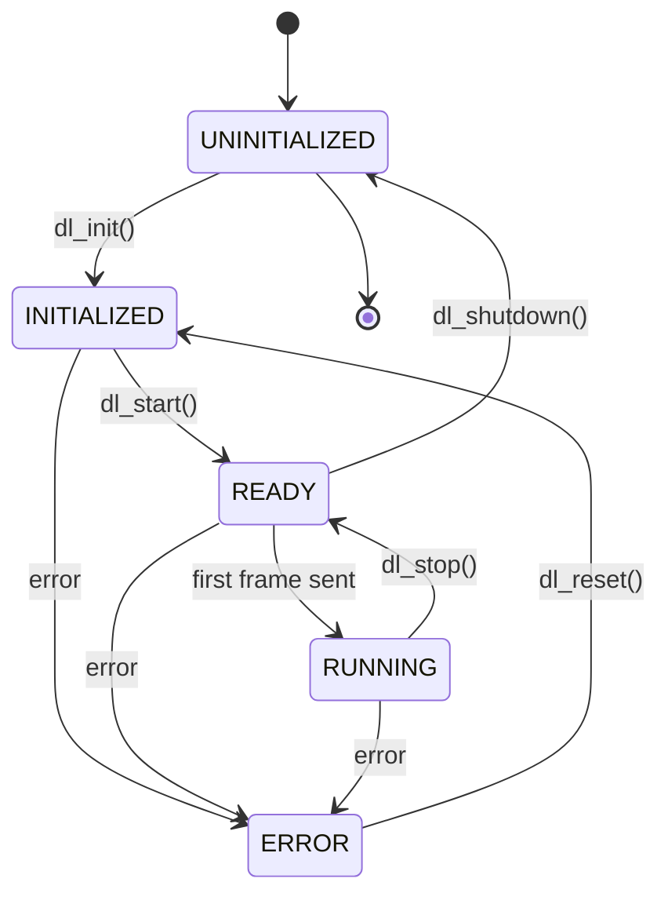
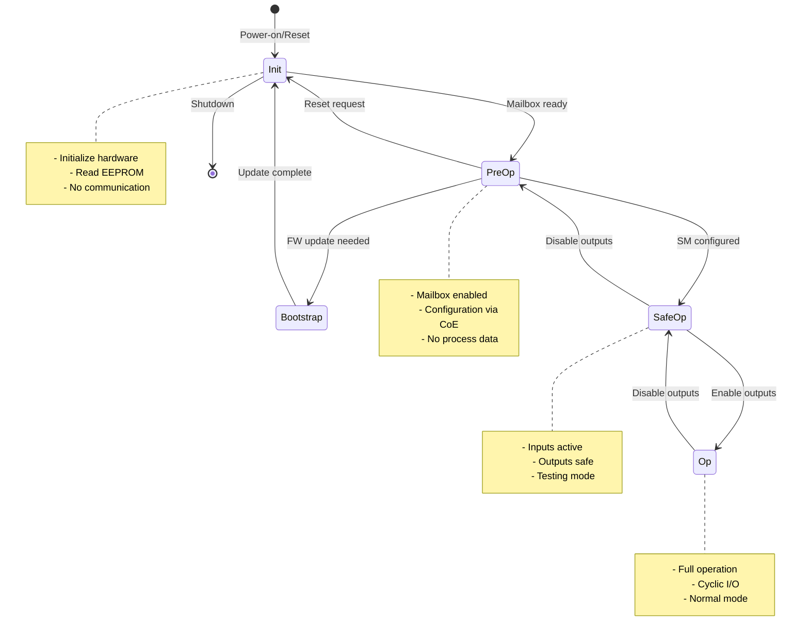
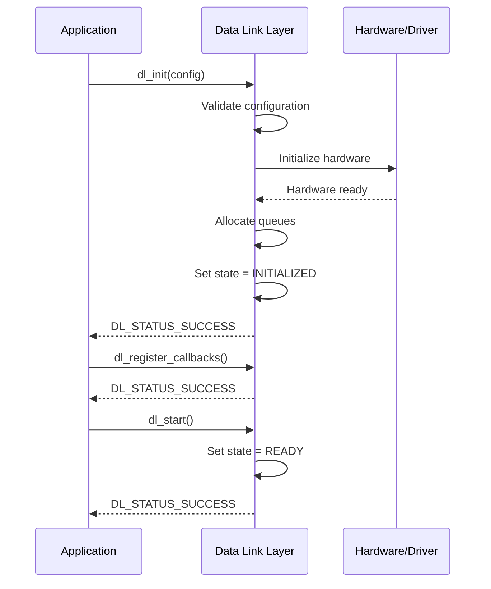
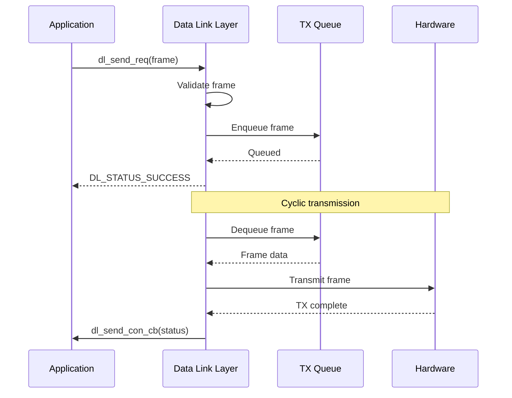
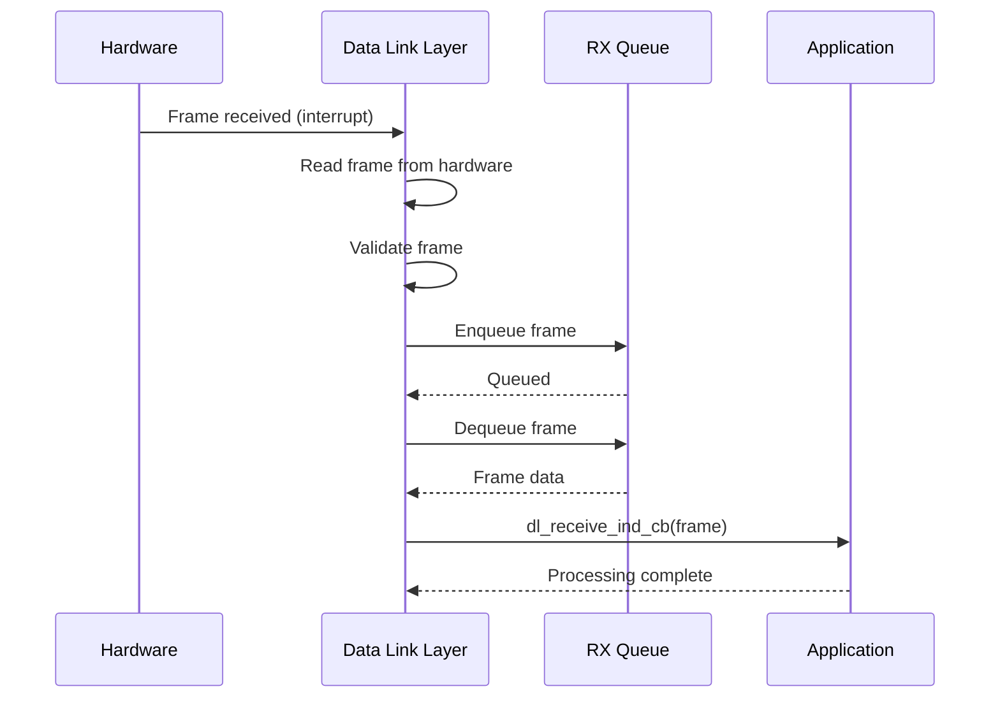

# EtherCAT Master Stack - Technical Specification

## Document Information
- **Version**: 1.0.0
- **Based on**: ETG1000 Series Version 1.0.4
- **Language**: C11
- **Target**: Embedded Systems

---

## Table of Contents
1. [Data Link Layer Services (DLL)](#data-link-layer-services-dll)
2. [Data Link Layer Protocol](#data-link-layer-protocol)
3. [Application Layer Services](#application-layer-services)
4. [Application Layer Protocol](#application-layer-protocol)

---

## Data Link Layer Services (DLL)

Based on ETG1000_3 specification, the Data Link Layer provides services for frame transmission and reception between the master and slaves.

### 1.1 DLL Service Primitives

The DLL layer provides the following service primitives:

#### 1.1.1 DL_Send Service

**Purpose**: Request transmission of an EtherCAT frame

**Service Primitives**:
- `DL_Send.req` - Request to send a frame
- `DL_Send.con` - Confirmation of frame transmission

**Parameters**:
```c
typedef struct {
    uint8_t* frame_data;      // Pointer to frame data
    uint16_t frame_length;    // Length of frame in bytes
    uint8_t priority;         // Priority level (0-7)
    void* user_data;          // User context pointer
} dl_send_req_t;

typedef struct {
    uint8_t status;           // Transmission status
    void* user_data;          // User context pointer
} dl_send_con_t;
```

**Status Codes**:
```c
typedef enum {
    DL_STATUS_SUCCESS = 0x00,
    DL_STATUS_ERROR = 0x01,
    DL_STATUS_BUSY = 0x02,
    DL_STATUS_TIMEOUT = 0x03,
    DL_STATUS_INVALID_PARAM = 0x04
} dl_status_t;
```

#### 1.1.2 DL_Receive Service

**Purpose**: Indication of received EtherCAT frame

**Service Primitives**:
- `DL_Receive.ind` - Indication of received frame

**Parameters**:
```c
typedef struct {
    uint8_t* frame_data;      // Pointer to received frame data
    uint16_t frame_length;    // Length of received frame
    uint64_t timestamp;       // Reception timestamp (nanoseconds)
    uint8_t port;             // Reception port number
} dl_receive_ind_t;
```

### 1.2 DLL Service Interface Functions

#### 1.2.1 Initialization and Configuration

```c
/**
 * Initialize the Data Link Layer
 *
 * @param config Pointer to DLL configuration structure
 * @return DL_STATUS_SUCCESS on success, error code otherwise
 */
dl_status_t dl_init(const dl_config_t* config);

/**
 * Shutdown the Data Link Layer
 *
 * @return DL_STATUS_SUCCESS on success, error code otherwise
 */
dl_status_t dl_shutdown(void);

/**
 * Configure DLL parameters
 *
 * @param param_id Parameter identifier
 * @param value Pointer to parameter value
 * @param length Length of parameter value
 * @return DL_STATUS_SUCCESS on success, error code otherwise
 */
dl_status_t dl_set_parameter(uint16_t param_id, const void* value, uint16_t length);

/**
 * Get DLL parameter value
 *
 * @param param_id Parameter identifier
 * @param value Pointer to buffer for parameter value
 * @param length Pointer to length (in: buffer size, out: actual size)
 * @return DL_STATUS_SUCCESS on success, error code otherwise
 */
dl_status_t dl_get_parameter(uint16_t param_id, void* value, uint16_t* length);
```

#### 1.2.2 Frame Transmission

```c
/**
 * Send an EtherCAT frame
 *
 * @param req Pointer to send request structure
 * @return DL_STATUS_SUCCESS on success, error code otherwise
 */
dl_status_t dl_send_req(const dl_send_req_t* req);

/**
 * Send confirmation callback (called by DLL when transmission completes)
 *
 * @param con Pointer to send confirmation structure
 */
typedef void (*dl_send_con_cb_t)(const dl_send_con_t* con);

/**
 * Register send confirmation callback
 *
 * @param callback Callback function pointer
 * @return DL_STATUS_SUCCESS on success, error code otherwise
 */
dl_status_t dl_register_send_callback(dl_send_con_cb_t callback);
```

#### 1.2.3 Frame Reception

```c
/**
 * Receive indication callback (called by DLL when frame is received)
 *
 * @param ind Pointer to receive indication structure
 */
typedef void (*dl_receive_ind_cb_t)(const dl_receive_ind_t* ind);

/**
 * Register receive indication callback
 *
 * @param callback Callback function pointer
 * @return DL_STATUS_SUCCESS on success, error code otherwise
 */
dl_status_t dl_register_receive_callback(dl_receive_ind_cb_t callback);
```

### 1.3 DLL Configuration Structure

```c
typedef struct {
    uint8_t mac_address[6];           // Master MAC address
    uint16_t max_frame_size;          // Maximum frame size (bytes)
    uint16_t tx_queue_size;           // Transmission queue size
    uint16_t rx_queue_size;           // Reception queue size
    uint32_t cycle_time_us;           // Cycle time in microseconds
    uint8_t num_ports;                // Number of Ethernet ports
    bool enable_redundancy;           // Enable redundancy support
    bool enable_distributed_clocks;   // Enable distributed clocks
} dl_config_t;
```

### 1.4 DLL State Machine

The DLL operates in the following states:

```c
typedef enum {
    DL_STATE_UNINITIALIZED = 0,
    DL_STATE_INITIALIZED,
    DL_STATE_READY,
    DL_STATE_RUNNING,
    DL_STATE_ERROR
} dl_state_t;
```

**State Transitions**:

```
UNINITIALIZED --[dl_init()]--> INITIALIZED
INITIALIZED --[dl_start()]--> READY
READY --[first frame sent]--> RUNNING
RUNNING --[dl_stop()]--> READY
READY --[dl_shutdown()]--> UNINITIALIZED
ANY_STATE --[error]--> ERROR
ERROR --[dl_reset()]--> INITIALIZED
```

#### State Machine Diagram (Mermaid)



### 1.5 DLL Control Functions

```c
/**
 * Start the Data Link Layer
 *
 * @return DL_STATUS_SUCCESS on success, error code otherwise
 */
dl_status_t dl_start(void);

/**
 * Stop the Data Link Layer
 *
 * @return DL_STATUS_SUCCESS on success, error code otherwise
 */
dl_status_t dl_stop(void);

/**
 * Reset the Data Link Layer (from ERROR state)
 *
 * @return DL_STATUS_SUCCESS on success, error code otherwise
 */
dl_status_t dl_reset(void);

/**
 * Get current DLL state
 *
 * @return Current DLL state
 */
dl_state_t dl_get_state(void);
```

### 1.6 DLL Statistics and Diagnostics

```c
typedef struct {
    uint64_t frames_sent;             // Total frames sent
    uint64_t frames_received;         // Total frames received
    uint64_t send_errors;             // Send error count
    uint64_t receive_errors;          // Receive error count
    uint64_t tx_queue_overflows;      // TX queue overflow count
    uint64_t rx_queue_overflows;      // RX queue overflow count
    uint32_t last_cycle_time_us;      // Last cycle time (microseconds)
    uint32_t max_cycle_time_us;       // Maximum cycle time observed
    uint32_t min_cycle_time_us;       // Minimum cycle time observed
} dl_statistics_t;

/**
 * Get DLL statistics
 *
 * @param stats Pointer to statistics structure
 * @return DL_STATUS_SUCCESS on success, error code otherwise
 */
dl_status_t dl_get_statistics(dl_statistics_t* stats);

/**
 * Reset DLL statistics counters
 *
 * @return DL_STATUS_SUCCESS on success, error code otherwise
 */
dl_status_t dl_reset_statistics(void);
```

### 1.7 DLL Parameter IDs

```c
typedef enum {
    DL_PARAM_MAC_ADDRESS = 0x0001,
    DL_PARAM_MAX_FRAME_SIZE = 0x0002,
    DL_PARAM_CYCLE_TIME = 0x0003,
    DL_PARAM_TX_QUEUE_SIZE = 0x0004,
    DL_PARAM_RX_QUEUE_SIZE = 0x0005,
    DL_PARAM_REDUNDANCY_ENABLE = 0x0006,
    DL_PARAM_DC_ENABLE = 0x0007,
    DL_PARAM_NUM_PORTS = 0x0008
} dl_param_id_t;
```

### 1.8 DLL Timing Requirements

Based on ETG1000_3 specification:

- **Minimum Cycle Time**: 50 microseconds (typical: 250-1000 microseconds)
- **Frame Processing Time**: < 1 microsecond per slave
- **Maximum Frame Size**: 1518 bytes (Ethernet frame)
- **Jitter Tolerance**: < 1 microsecond (with Distributed Clocks)

### 1.9 DLL Queue Management

```c
typedef struct {
    uint8_t* buffer;          // Frame buffer
    uint16_t length;          // Frame length
    uint8_t priority;         // Priority level
    void* user_data;          // User context
    uint64_t timestamp;       // Enqueue timestamp
} dl_queue_entry_t;

/**
 * Get number of frames in TX queue
 *
 * @return Number of queued frames
 */
uint16_t dl_get_tx_queue_count(void);

/**
 * Get number of frames in RX queue
 *
 * @return Number of queued frames
 */
uint16_t dl_get_rx_queue_count(void);

/**
 * Flush TX queue (discard all pending frames)
 *
 * @return DL_STATUS_SUCCESS on success, error code otherwise
 */
dl_status_t dl_flush_tx_queue(void);

/**
 * Flush RX queue (discard all pending frames)
 *
 * @return DL_STATUS_SUCCESS on success, error code otherwise
 */
dl_status_t dl_flush_rx_queue(void);
```

### 1.10 DLL Error Handling

```c
typedef enum {
    DL_ERROR_NONE = 0x00,
    DL_ERROR_INIT_FAILED = 0x01,
    DL_ERROR_INVALID_STATE = 0x02,
    DL_ERROR_QUEUE_FULL = 0x03,
    DL_ERROR_QUEUE_EMPTY = 0x04,
    DL_ERROR_INVALID_FRAME = 0x05,
    DL_ERROR_TX_TIMEOUT = 0x06,
    DL_ERROR_RX_TIMEOUT = 0x07,
    DL_ERROR_HARDWARE = 0x08,
    DL_ERROR_NO_MEMORY = 0x09,
    DL_ERROR_INVALID_PARAM = 0x0A
} dl_error_t;

/**
 * Get last DLL error code
 *
 * @return Last error code
 */
dl_error_t dl_get_last_error(void);

/**
 * Get error description string
 *
 * @param error Error code
 * @return Pointer to error description string
 */
const char* dl_get_error_string(dl_error_t error);

/**
 * Error callback function type
 *
 * @param error Error code
 * @param context Error context information
 */
typedef void (*dl_error_cb_t)(dl_error_t error, const char* context);

/**
 * Register error callback
 *
 * @param callback Callback function pointer
 * @return DL_STATUS_SUCCESS on success, error code otherwise
 */
dl_status_t dl_register_error_callback(dl_error_cb_t callback);
```

---

## Data Link Layer Protocol

Based on ETG1000_4 specification, the Data Link Layer Protocol defines the frame structure, datagram types, and addressing mechanisms for EtherCAT communication.

### 2.1 EtherCAT Frame Structure

#### 2.1.1 Ethernet Frame Format

```c
/**
 * @brief Ethernet II frame header
 */
typedef struct __attribute__((packed)) {
    uint8_t destination[6];      /**< Destination MAC address */
    uint8_t source[6];           /**< Source MAC address */
    uint16_t ethertype;          /**< EtherType (0x88A4 for EtherCAT) */
} eth_header_t;

#define ETHERCAT_ETHERTYPE 0x88A4

/**
 * @brief EtherCAT frame header
 */
typedef struct __attribute__((packed)) {
    uint16_t length : 11;        /**< Length of EtherCAT data (bits 0-10) */
    uint16_t reserved : 1;       /**< Reserved (bit 11) */
    uint16_t type : 4;           /**< Protocol type (bits 12-15) */
} ecat_header_t;

#define ECAT_TYPE_DLPDU 0x1      /**< Data Link Protocol Data Unit */
```

#### 2.1.2 Complete Frame Structure

```c
/**
 * @brief Complete EtherCAT frame
 */
typedef struct __attribute__((packed)) {
    eth_header_t eth_header;     /**< Ethernet header */
    ecat_header_t ecat_header;   /**< EtherCAT header */
    uint8_t data[1486];          /**< EtherCAT datagrams (max 1486 bytes) */
    uint32_t fcs;                /**< Frame Check Sequence (CRC32) */
} ecat_frame_t;

#define ECAT_MAX_DATA_SIZE 1486
#define ECAT_MIN_FRAME_SIZE 64
#define ECAT_MAX_FRAME_SIZE 1518
```

### 2.2 EtherCAT Datagram Structure

#### 2.2.1 Datagram Header

```c
/**
 * @brief EtherCAT datagram header
 */
typedef struct __attribute__((packed)) {
    uint8_t cmd;                 /**< Command type */
    uint8_t idx;                 /**< Index (for identification) */
    uint32_t address;            /**< Address (interpretation depends on cmd) */
    uint16_t length : 11;        /**< Data length in bytes (bits 0-10) */
    uint16_t reserved : 3;       /**< Reserved (bits 11-13) */
    uint16_t circulating : 1;    /**< Circulating frame (bit 14) */
    uint16_t more : 1;           /**< More datagrams follow (bit 15) */
    uint16_t irq;                /**< Interrupt request */
} ecat_datagram_header_t;

#define ECAT_DATAGRAM_HEADER_SIZE 10
```

#### 2.2.2 Complete Datagram Structure

```c
/**
 * @brief Complete EtherCAT datagram
 */
typedef struct __attribute__((packed)) {
    ecat_datagram_header_t header;  /**< Datagram header */
    uint8_t data[1486];             /**< Data payload */
    uint16_t wkc;                   /**< Working Counter */
} ecat_datagram_t;

#define ECAT_MAX_DATAGRAM_DATA_SIZE 1486
```

### 2.3 Datagram Command Types

#### 2.3.1 Command Type Enumeration

```c
/**
 * @brief EtherCAT command types
 */
typedef enum {
    /* Physical addressing - Auto-increment */
    ECAT_CMD_NOP = 0x00,         /**< No Operation */
    ECAT_CMD_APRD = 0x01,        /**< Auto-increment Physical Read */
    ECAT_CMD_APWR = 0x02,        /**< Auto-increment Physical Write */
    ECAT_CMD_APRW = 0x03,        /**< Auto-increment Physical Read/Write */

    /* Physical addressing - Configured */
    ECAT_CMD_FPRD = 0x04,        /**< Configured Physical Read */
    ECAT_CMD_FPWR = 0x05,        /**< Configured Physical Write */
    ECAT_CMD_FPRW = 0x06,        /**< Configured Physical Read/Write */

    /* Broadcast */
    ECAT_CMD_BRD = 0x07,         /**< Broadcast Read */
    ECAT_CMD_BWR = 0x08,         /**< Broadcast Write */
    ECAT_CMD_BRW = 0x09,         /**< Broadcast Read/Write */

    /* Logical addressing */
    ECAT_CMD_LRD = 0x0A,         /**< Logical Read */
    ECAT_CMD_LWR = 0x0B,         /**< Logical Write */
    ECAT_CMD_LRW = 0x0C,         /**< Logical Read/Write */

    /* Configured addressing with multiple slaves */
    ECAT_CMD_ARMW = 0x0D,        /**< Auto-increment Read Multiple Write */
    ECAT_CMD_FRMW = 0x0E         /**< Configured Read Multiple Write */
} ecat_cmd_t;
```

#### 2.3.2 Command Type Descriptions

```c
/**
 * @brief Get command type name
 *
 * @param cmd Command type
 * @return Pointer to command name string
 */
const char* ecat_cmd_get_name(ecat_cmd_t cmd);

/**
 * @brief Check if command is read operation
 *
 * @param cmd Command type
 * @return true if read operation, false otherwise
 */
bool ecat_cmd_is_read(ecat_cmd_t cmd);

/**
 * @brief Check if command is write operation
 *
 * @param cmd Command type
 * @return true if write operation, false otherwise
 */
bool ecat_cmd_is_write(ecat_cmd_t cmd);

/**
 * @brief Check if command is read/write operation
 *
 * @param cmd Command type
 * @return true if read/write operation, false otherwise
 */
bool ecat_cmd_is_readwrite(ecat_cmd_t cmd);
```

### 2.4 Addressing Modes

#### 2.4.1 Auto-increment Addressing

```c
/**
 * @brief Auto-increment address structure
 *
 * Used for APRD, APWR, APRW commands
 * Address format: -<slave_position> (negative position)
 */
typedef struct {
    int16_t position;            /**< Slave position (negative, -1 to -65535) */
    uint16_t offset;             /**< Memory offset within slave */
} ecat_addr_autoincrement_t;

/**
 * @brief Build auto-increment address
 *
 * @param position Slave position (1-based, will be negated)
 * @param offset Memory offset
 * @return 32-bit address value
 */
static inline uint32_t ecat_addr_autoincrement(uint16_t position, uint16_t offset)
{
    return ((uint32_t)(-position) << 16) | offset;
}
```

#### 2.4.2 Configured (Fixed) Addressing

```c
/**
 * @brief Configured address structure
 *
 * Used for FPRD, FPWR, FPRW commands
 * Address format: <configured_station_address>:<offset>
 */
typedef struct {
    uint16_t station_address;    /**< Configured station address */
    uint16_t offset;             /**< Memory offset within slave */
} ecat_addr_configured_t;

/**
 * @brief Build configured address
 *
 * @param station_address Configured station address
 * @param offset Memory offset
 * @return 32-bit address value
 */
static inline uint32_t ecat_addr_configured(uint16_t station_address, uint16_t offset)
{
    return ((uint32_t)station_address << 16) | offset;
}
```

#### 2.4.3 Logical Addressing

```c
/**
 * @brief Logical address
 *
 * Used for LRD, LWR, LRW commands
 * Address is a 32-bit logical memory address
 */
typedef uint32_t ecat_addr_logical_t;

/**
 * @brief Build logical address
 *
 * @param address Logical address (0x00000000 to 0xFFFFFFFF)
 * @return 32-bit address value
 */
static inline uint32_t ecat_addr_logical(uint32_t address)
{
    return address;
}
```

### 2.5 Working Counter

#### 2.5.1 Working Counter Definition

```c
/**
 * @brief Working counter operations
 *
 * The working counter (WKC) is incremented by each slave that
 * successfully processes a datagram.
 */

/**
 * @brief Working counter increment rules
 */
typedef enum {
    WKC_INCREMENT_READ = 1,      /**< Increment by 1 for read operations */
    WKC_INCREMENT_WRITE = 1,     /**< Increment by 1 for write operations */
    WKC_INCREMENT_READWRITE = 2  /**< Increment by 2 for read/write operations */
} wkc_increment_t;

/**
 * @brief Validate working counter
 *
 * Checks if the working counter matches the expected value
 *
 * @param expected Expected working counter value
 * @param actual Actual working counter value
 * @return true if valid, false otherwise
 */
bool ecat_wkc_validate(uint16_t expected, uint16_t actual);
```

### 2.6 Frame Building and Parsing

#### 2.6.1 Frame Builder

```c
/**
 * @brief Frame builder context
 */
typedef struct {
    uint8_t* buffer;             /**< Frame buffer */
    uint16_t buffer_size;        /**< Buffer size */
    uint16_t current_offset;     /**< Current write offset */
    uint8_t datagram_count;      /**< Number of datagrams added */
} ecat_frame_builder_t;

/**
 * @brief Initialize frame builder
 *
 * @param builder Pointer to frame builder
 * @param buffer Frame buffer
 * @param buffer_size Buffer size
 * @param src_mac Source MAC address
 * @param dst_mac Destination MAC address
 * @return DL_STATUS_SUCCESS on success, error code otherwise
 */
dl_status_t ecat_frame_builder_init(ecat_frame_builder_t* builder,
                                     uint8_t* buffer,
                                     uint16_t buffer_size,
                                     const uint8_t src_mac[6],
                                     const uint8_t dst_mac[6]);

/**
 * @brief Add datagram to frame
 *
 * @param builder Pointer to frame builder
 * @param cmd Command type
 * @param idx Datagram index
 * @param address Address (interpretation depends on cmd)
 * @param data Data to write (NULL for read operations)
 * @param length Data length
 * @param more More datagrams will follow
 * @return DL_STATUS_SUCCESS on success, error code otherwise
 */
dl_status_t ecat_frame_builder_add_datagram(ecat_frame_builder_t* builder,
                                              ecat_cmd_t cmd,
                                              uint8_t idx,
                                              uint32_t address,
                                              const uint8_t* data,
                                              uint16_t length,
                                              bool more);

/**
 * @brief Finalize frame (add FCS)
 *
 * @param builder Pointer to frame builder
 * @param frame_length Pointer to receive final frame length
 * @return DL_STATUS_SUCCESS on success, error code otherwise
 */
dl_status_t ecat_frame_builder_finalize(ecat_frame_builder_t* builder,
                                         uint16_t* frame_length);
```

#### 2.6.2 Frame Parser

```c
/**
 * @brief Frame parser context
 */
typedef struct {
    const uint8_t* buffer;       /**< Frame buffer */
    uint16_t buffer_size;        /**< Buffer size */
    uint16_t current_offset;     /**< Current read offset */
    uint8_t datagram_count;      /**< Number of datagrams parsed */
} ecat_frame_parser_t;

/**
 * @brief Initialize frame parser
 *
 * @param parser Pointer to frame parser
 * @param buffer Frame buffer
 * @param buffer_size Buffer size
 * @return DL_STATUS_SUCCESS on success, error code otherwise
 */
dl_status_t ecat_frame_parser_init(ecat_frame_parser_t* parser,
                                    const uint8_t* buffer,
                                    uint16_t buffer_size);

/**
 * @brief Validate frame headers
 *
 * @param parser Pointer to frame parser
 * @return DL_STATUS_SUCCESS if valid, error code otherwise
 */
dl_status_t ecat_frame_parser_validate(ecat_frame_parser_t* parser);

/**
 * @brief Get next datagram from frame
 *
 * @param parser Pointer to frame parser
 * @param datagram Pointer to receive datagram
 * @return DL_STATUS_SUCCESS on success, error code otherwise
 */
dl_status_t ecat_frame_parser_next_datagram(ecat_frame_parser_t* parser,
                                              ecat_datagram_t* datagram);

/**
 * @brief Check if more datagrams are available
 *
 * @param parser Pointer to frame parser
 * @return true if more datagrams available, false otherwise
 */
bool ecat_frame_parser_has_more(const ecat_frame_parser_t* parser);
```

### 2.7 CRC Calculation

```c
/**
 * @brief Calculate Ethernet FCS (CRC32)
 *
 * @param data Pointer to data
 * @param length Data length
 * @return CRC32 value
 */
uint32_t ecat_calculate_fcs(const uint8_t* data, uint16_t length);

/**
 * @brief Verify Ethernet FCS
 *
 * @param frame Pointer to frame
 * @param frame_length Frame length
 * @return true if FCS is valid, false otherwise
 */
bool ecat_verify_fcs(const uint8_t* frame, uint16_t frame_length);
```

### 2.8 Frame Timing and Constraints

```c
/**
 * @brief Frame timing constraints (from ETG1000_4)
 */
#define ECAT_FRAME_PROCESSING_TIME_NS   1000    /**< Frame processing time per slave (1 us) */
#define ECAT_MIN_FRAME_GAP_NS           960     /**< Minimum inter-frame gap (960 ns) */
#define ECAT_MAX_FRAME_RATE_HZ          100000  /**< Maximum frame rate (100 kHz) */

/**
 * @brief Calculate expected round-trip time
 *
 * @param num_slaves Number of slaves in network
 * @param cable_length_m Total cable length in meters
 * @return Expected RTT in nanoseconds
 */
uint32_t ecat_calculate_rtt(uint16_t num_slaves, uint32_t cable_length_m);
```

---

## Application Layer Services

Based on ETG1000_5 specification, the Application Layer provides services for slave device management, state machine control, and mailbox communication.

### 3.1 AL State Machine

The EtherCAT Application Layer implements a state machine for each slave device. The master controls state transitions through AL Control register writes.

#### 3.1.1 AL States

```c
/**
 * @brief Application Layer states
 */
typedef enum {
    AL_STATE_INIT = 0x01,           /**< Init state */
    AL_STATE_PREOP = 0x02,          /**< Pre-Operational state */
    AL_STATE_BOOT = 0x03,           /**< Bootstrap state */
    AL_STATE_SAFEOP = 0x04,         /**< Safe-Operational state */
    AL_STATE_OP = 0x08              /**< Operational state */
} al_state_t;
```

#### 3.1.2 AL State Descriptions

**Init State (0x01)**:
- Initial state after power-on or reset
- Slave initializes communication interfaces
- No mailbox or process data communication
- Slave reads EEPROM configuration

**Pre-Operational State (0x02)**:
- Mailbox communication is enabled
- Process data communication is disabled
- Configuration and parameterization via mailbox
- SDO access available (CoE)

**Bootstrap State (0x03)**:
- Special state for firmware updates
- Only FoE (File over EtherCAT) mailbox protocol enabled
- Used for uploading new firmware to slave

**Safe-Operational State (0x04)**:
- Mailbox communication enabled
- Process data communication enabled (inputs only)
- Outputs are in safe state (typically zero)
- Used for testing and verification

**Operational State (0x08)**:
- Full operation mode
- Mailbox and process data communication enabled
- Outputs are active and controlled by master
- Normal cyclic operation

#### 3.1.3 AL State Transitions

```c
/**
 * @brief AL state transition requests
 */
typedef enum {
    AL_TRANS_INIT_TO_PREOP,         /**< Init -> Pre-Op */
    AL_TRANS_PREOP_TO_INIT,         /**< Pre-Op -> Init */
    AL_TRANS_PREOP_TO_SAFEOP,       /**< Pre-Op -> Safe-Op */
    AL_TRANS_SAFEOP_TO_PREOP,       /**< Safe-Op -> Pre-Op */
    AL_TRANS_SAFEOP_TO_OP,          /**< Safe-Op -> Op */
    AL_TRANS_OP_TO_SAFEOP,          /**< Op -> Safe-Op */
    AL_TRANS_PREOP_TO_BOOT,         /**< Pre-Op -> Bootstrap */
    AL_TRANS_BOOT_TO_INIT           /**< Bootstrap -> Init */
} al_state_transition_t;
```

#### 3.1.4 AL State Machine Diagram



### 3.2 AL Control and Status Registers

#### 3.2.1 AL Control Register (0x0120)

```c
/**
 * @brief AL Control register structure (Master -> Slave)
 */
typedef struct __attribute__((packed)) {
    uint16_t state : 4;             /**< Requested state (bits 0-3) */
    uint16_t ack : 1;               /**< Acknowledge error (bit 4) */
    uint16_t request_id : 1;        /**< Request ID toggle (bit 5) */
    uint16_t reserved : 10;         /**< Reserved (bits 6-15) */
} al_control_t;

#define AL_CONTROL_REG_ADDR 0x0120
```

#### 3.2.2 AL Status Register (0x0130)

```c
/**
 * @brief AL Status register structure (Slave -> Master)
 */
typedef struct __attribute__((packed)) {
    uint16_t state : 4;             /**< Current state (bits 0-3) */
    uint16_t error : 1;             /**< Error flag (bit 4) */
    uint16_t id : 1;                /**< ID toggle (bit 5) */
    uint16_t reserved : 10;         /**< Reserved (bits 6-15) */
} al_status_t;

#define AL_STATUS_REG_ADDR 0x0130
```

#### 3.2.3 AL Status Code Register (0x0134)

```c
/**
 * @brief AL Status Code register (error codes)
 */
typedef enum {
    AL_STATUS_CODE_NO_ERROR = 0x0000,
    AL_STATUS_CODE_UNSPECIFIED = 0x0001,
    AL_STATUS_CODE_NO_MEMORY = 0x0002,
    AL_STATUS_CODE_INVALID_DEVICE_SETUP = 0x0003,
    AL_STATUS_CODE_INVALID_MAILBOX_CONFIG = 0x0004,
    AL_STATUS_CODE_INVALID_MAILBOX_CONFIG_PREOP = 0x0005,
    AL_STATUS_CODE_INVALID_SM_CONFIG = 0x0006,
    AL_STATUS_CODE_INVALID_SM_CONFIG_PREOP = 0x0007,
    AL_STATUS_CODE_INVALID_OUTPUT_CONFIG = 0x0008,
    AL_STATUS_CODE_INVALID_INPUT_CONFIG = 0x0009,
    AL_STATUS_CODE_INVALID_WATCHDOG_CONFIG = 0x000A,
    AL_STATUS_CODE_SLAVE_NEEDS_COLD_START = 0x000B,
    AL_STATUS_CODE_SLAVE_NEEDS_INIT = 0x000C,
    AL_STATUS_CODE_SLAVE_NEEDS_PREOP = 0x000D,
    AL_STATUS_CODE_SLAVE_NEEDS_SAFEOP = 0x000E,
    AL_STATUS_CODE_INVALID_INPUT_MAPPING = 0x000F,
    AL_STATUS_CODE_INVALID_OUTPUT_MAPPING = 0x0010,
    AL_STATUS_CODE_INCONSISTENT_SETTINGS = 0x0011,
    AL_STATUS_CODE_FREERUN_NOT_SUPPORTED = 0x0012,
    AL_STATUS_CODE_SYNC_NOT_SUPPORTED = 0x0013,
    AL_STATUS_CODE_FREERUN_NEEDS_3BUFFER = 0x0014,
    AL_STATUS_CODE_BACKGROUND_WATCHDOG = 0x0015,
    AL_STATUS_CODE_NO_VALID_INPUTS = 0x0016,
    AL_STATUS_CODE_NO_VALID_OUTPUTS = 0x0017,
    AL_STATUS_CODE_SYNC_ERROR = 0x0018,
    AL_STATUS_CODE_SYNC_WATCHDOG = 0x0019,
    AL_STATUS_CODE_INVALID_SYNC_TYPES = 0x001A,
    AL_STATUS_CODE_INVALID_OUTPUT_CONFIG_SAFEOP = 0x001B,
    AL_STATUS_CODE_INVALID_INPUT_CONFIG_SAFEOP = 0x001C,
    AL_STATUS_CODE_INVALID_WATCHDOG_CONFIG_SAFEOP = 0x001D,
    AL_STATUS_CODE_SLAVE_NEEDS_BOOT = 0x001E
} al_status_code_t;

#define AL_STATUS_CODE_REG_ADDR 0x0134
```

### 3.3 Sync Manager (SM)

Sync Managers are hardware units in the slave that manage data transfer between master and slave memory.

#### 3.3.1 Sync Manager Types

```c
/**
 * @brief Sync Manager types
 */
typedef enum {
    SM_TYPE_MAILBOX_WRITE = 0,      /**< Mailbox write (Master -> Slave) */
    SM_TYPE_MAILBOX_READ = 1,       /**< Mailbox read (Slave -> Master) */
    SM_TYPE_PROCESS_DATA_WRITE = 2, /**< Process data outputs (Master -> Slave) */
    SM_TYPE_PROCESS_DATA_READ = 3   /**< Process data inputs (Slave -> Master) */
} sm_type_t;
```

#### 3.3.2 Sync Manager Configuration

```c
/**
 * @brief Sync Manager configuration structure
 */
typedef struct __attribute__((packed)) {
    uint16_t physical_start_address; /**< Physical start address */
    uint16_t length;                 /**< Length in bytes */
    uint8_t control;                 /**< Control register */
    uint8_t status;                  /**< Status register */
    uint8_t enable;                  /**< Enable register */
    uint8_t pdi_control;             /**< PDI control register */
} sm_config_t;

#define SM_CONFIG_BASE_ADDR 0x0800
#define SM_CONFIG_SIZE 8
#define SM_MAX_COUNT 16
```

#### 3.3.3 Sync Manager Control Register

```c
/**
 * @brief SM Control register bits
 */
typedef struct {
    uint8_t operation_mode : 2;     /**< Operation mode (bits 0-1) */
    uint8_t direction : 1;          /**< Direction: 0=read, 1=write (bit 2) */
    uint8_t ecat_event : 1;         /**< EtherCAT event enable (bit 3) */
    uint8_t dls_user_event : 1;     /**< DLS user event enable (bit 4) */
    uint8_t reserved : 1;           /**< Reserved (bit 5) */
    uint8_t watchdog : 1;           /**< Watchdog trigger (bit 6) */
    uint8_t reserved2 : 1;          /**< Reserved (bit 7) */
} sm_control_bits_t;

/**
 * @brief SM operation modes
 */
typedef enum {
    SM_OP_MODE_3BUFFER = 0x00,      /**< 3-buffer mode */
    SM_OP_MODE_1BUFFER = 0x02       /**< 1-buffer mode (mailbox) */
} sm_operation_mode_t;
```

### 3.4 Mailbox Protocol

The mailbox provides a channel for acyclic communication between master and slave.

#### 3.4.1 Mailbox Header

```c
/**
 * @brief Mailbox header structure
 */
typedef struct __attribute__((packed)) {
    uint16_t length;                /**< Data length (bits 0-15) */
    uint16_t address;               /**< Slave address */
    uint8_t channel : 6;            /**< Channel (bits 0-5) */
    uint8_t priority : 2;           /**< Priority (bits 6-7) */
    uint8_t type;                   /**< Mailbox protocol type */
    uint8_t data[];                 /**< Mailbox data */
} mailbox_header_t;

#define MAILBOX_HEADER_SIZE 6
```

#### 3.4.2 Mailbox Protocol Types

```c
/**
 * @brief Mailbox protocol types
 */
typedef enum {
    MBOX_TYPE_ERROR = 0x00,         /**< Error response */
    MBOX_TYPE_AOE = 0x01,           /**< ADS over EtherCAT */
    MBOX_TYPE_EOE = 0x02,           /**< Ethernet over EtherCAT */
    MBOX_TYPE_COE = 0x03,           /**< CANopen over EtherCAT */
    MBOX_TYPE_FOE = 0x04,           /**< File over EtherCAT */
    MBOX_TYPE_SOE = 0x05,           /**< Servo over EtherCAT */
    MBOX_TYPE_VOE = 0x0F            /**< Vendor specific over EtherCAT */
} mailbox_type_t;
```

#### 3.4.3 Mailbox State Machine

```c
/**
 * @brief Mailbox states
 */
typedef enum {
    MBOX_STATE_IDLE,                /**< Idle, ready for new request */
    MBOX_STATE_WRITE_REQUESTED,     /**< Write request pending */
    MBOX_STATE_WRITE_IN_PROGRESS,   /**< Writing to slave */
    MBOX_STATE_READ_REQUESTED,      /**< Read request pending */
    MBOX_STATE_READ_IN_PROGRESS,    /**< Reading from slave */
    MBOX_STATE_ERROR                /**< Error state */
} mailbox_state_t;
```

### 3.5 AL Service Primitives

#### 3.5.1 AL State Change Service

```c
/**
 * @brief AL_Control.req - Request state change
 */
typedef struct {
    uint16_t slave_address;         /**< Slave station address */
    al_state_t requested_state;     /**< Requested AL state */
    uint32_t timeout_ms;            /**< Timeout in milliseconds */
    void* user_data;                /**< User context */
} al_control_req_t;

/**
 * @brief AL_Control.con - State change confirmation
 */
typedef struct {
    uint16_t slave_address;         /**< Slave station address */
    al_state_t current_state;       /**< Current AL state */
    al_status_code_t status_code;   /**< Status code (0 = success) */
    void* user_data;                /**< User context */
} al_control_con_t;

/**
 * @brief AL_Control.ind - State change indication
 */
typedef struct {
    uint16_t slave_address;         /**< Slave station address */
    al_state_t old_state;           /**< Previous AL state */
    al_state_t new_state;           /**< New AL state */
    al_status_code_t status_code;   /**< Status code */
} al_control_ind_t;
```

#### 3.5.2 Mailbox Service Primitives

```c
/**
 * @brief MBX_Send.req - Send mailbox message
 */
typedef struct {
    uint16_t slave_address;         /**< Slave station address */
    mailbox_type_t type;            /**< Mailbox protocol type */
    uint8_t* data;                  /**< Message data */
    uint16_t length;                /**< Data length */
    uint8_t priority;               /**< Priority (0-3) */
    void* user_data;                /**< User context */
} mbx_send_req_t;

/**
 * @brief MBX_Send.con - Mailbox send confirmation
 */
typedef struct {
    uint16_t slave_address;         /**< Slave station address */
    uint8_t status;                 /**< Send status */
    void* user_data;                /**< User context */
} mbx_send_con_t;

/**
 * @brief MBX_Receive.ind - Mailbox receive indication
 */
typedef struct {
    uint16_t slave_address;         /**< Slave station address */
    mailbox_type_t type;            /**< Mailbox protocol type */
    uint8_t* data;                  /**< Received data */
    uint16_t length;                /**< Data length */
} mbx_receive_ind_t;
```

### 3.6 AL Service Interface Functions

#### 3.6.1 Initialization and Configuration

```c
/**
 * @brief AL status codes
 */
typedef enum {
    AL_STATUS_SUCCESS = 0x00,
    AL_STATUS_ERROR = 0x01,
    AL_STATUS_BUSY = 0x02,
    AL_STATUS_TIMEOUT = 0x03,
    AL_STATUS_INVALID_PARAM = 0x04,
    AL_STATUS_INVALID_STATE = 0x05,
    AL_STATUS_NOT_INITIALIZED = 0x06
} al_status_t;

/**
 * @brief Initialize Application Layer
 *
 * @param config Pointer to AL configuration
 * @return AL_STATUS_SUCCESS on success, error code otherwise
 */
al_status_t al_init(const al_config_t* config);

/**
 * @brief Shutdown Application Layer
 *
 * @return AL_STATUS_SUCCESS on success, error code otherwise
 */
al_status_t al_shutdown(void);
```

#### 3.6.2 State Control Functions

```c
/**
 * @brief Request AL state change for a slave
 *
 * @param slave_address Slave station address
 * @param requested_state Requested AL state
 * @param timeout_ms Timeout in milliseconds
 * @return AL_STATUS_SUCCESS on success, error code otherwise
 */
al_status_t al_request_state(uint16_t slave_address,
                              al_state_t requested_state,
                              uint32_t timeout_ms);

/**
 * @brief Get current AL state of a slave
 *
 * @param slave_address Slave station address
 * @param state Pointer to receive current state
 * @return AL_STATUS_SUCCESS on success, error code otherwise
 */
al_status_t al_get_state(uint16_t slave_address, al_state_t* state);

/**
 * @brief Get AL status code of a slave
 *
 * @param slave_address Slave station address
 * @param status_code Pointer to receive status code
 * @return AL_STATUS_SUCCESS on success, error code otherwise
 */
al_status_t al_get_status_code(uint16_t slave_address,
                                al_status_code_t* status_code);

/**
 * @brief Read AL Control register
 *
 * @param slave_address Slave station address
 * @param control Pointer to receive control register value
 * @return AL_STATUS_SUCCESS on success, error code otherwise
 */
al_status_t al_read_control(uint16_t slave_address, al_control_t* control);

/**
 * @brief Write AL Control register
 *
 * @param slave_address Slave station address
 * @param control Pointer to control register value
 * @return AL_STATUS_SUCCESS on success, error code otherwise
 */
al_status_t al_write_control(uint16_t slave_address, const al_control_t* control);

/**
 * @brief Read AL Status register
 *
 * @param slave_address Slave station address
 * @param status Pointer to receive status register value
 * @return AL_STATUS_SUCCESS on success, error code otherwise
 */
al_status_t al_read_status(uint16_t slave_address, al_status_t* status);
```

#### 3.6.3 Mailbox Functions

```c
/**
 * @brief Send mailbox message to slave
 *
 * @param req Pointer to mailbox send request
 * @return AL_STATUS_SUCCESS on success, error code otherwise
 */
al_status_t al_mailbox_send(const mbx_send_req_t* req);

/**
 * @brief Check if mailbox message is available
 *
 * @param slave_address Slave station address
 * @param available Pointer to receive availability flag
 * @return AL_STATUS_SUCCESS on success, error code otherwise
 */
al_status_t al_mailbox_check(uint16_t slave_address, bool* available);

/**
 * @brief Receive mailbox message from slave
 *
 * @param slave_address Slave station address
 * @param type Pointer to receive mailbox type
 * @param data Buffer for received data
 * @param length Pointer to buffer length (in: max, out: actual)
 * @return AL_STATUS_SUCCESS on success, error code otherwise
 */
al_status_t al_mailbox_receive(uint16_t slave_address,
                                mailbox_type_t* type,
                                uint8_t* data,
                                uint16_t* length);
```

#### 3.6.4 Sync Manager Functions

```c
/**
 * @brief Configure Sync Manager
 *
 * @param slave_address Slave station address
 * @param sm_index Sync Manager index (0-15)
 * @param config Pointer to SM configuration
 * @return AL_STATUS_SUCCESS on success, error code otherwise
 */
al_status_t al_sm_config(uint16_t slave_address,
                          uint8_t sm_index,
                          const sm_config_t* config);

/**
 * @brief Read Sync Manager configuration
 *
 * @param slave_address Slave station address
 * @param sm_index Sync Manager index (0-15)
 * @param config Pointer to receive SM configuration
 * @return AL_STATUS_SUCCESS on success, error code otherwise
 */
al_status_t al_sm_read_config(uint16_t slave_address,
                               uint8_t sm_index,
                               sm_config_t* config);

/**
 * @brief Enable Sync Manager
 *
 * @param slave_address Slave station address
 * @param sm_index Sync Manager index (0-15)
 * @return AL_STATUS_SUCCESS on success, error code otherwise
 */
al_status_t al_sm_enable(uint16_t slave_address, uint8_t sm_index);

/**
 * @brief Disable Sync Manager
 *
 * @param slave_address Slave station address
 * @param sm_index Sync Manager index (0-15)
 * @return AL_STATUS_SUCCESS on success, error code otherwise
 */
al_status_t al_sm_disable(uint16_t slave_address, uint8_t sm_index);
```

### 3.7 AL Configuration Structure

```c
/**
 * @brief Application Layer configuration
 */
typedef struct {
    uint32_t state_transition_timeout_ms;  /**< State transition timeout */
    uint32_t mailbox_timeout_ms;           /**< Mailbox operation timeout */
    uint16_t max_slaves;                   /**< Maximum number of slaves */
    bool enable_distributed_clocks;        /**< Enable DC support */
    void* user_data;                       /**< User context */
} al_config_t;
```

### 3.8 AL Callback Functions

```c
/**
 * @brief State change indication callback
 *
 * @param ind Pointer to state change indication
 */
typedef void (*al_state_change_cb_t)(const al_control_ind_t* ind);

/**
 * @brief Mailbox receive indication callback
 *
 * @param ind Pointer to mailbox receive indication
 */
typedef void (*al_mailbox_receive_cb_t)(const mbx_receive_ind_t* ind);

/**
 * @brief AL error callback
 *
 * @param slave_address Slave station address
 * @param error_code AL status code
 * @param context Error context string
 */
typedef void (*al_error_cb_t)(uint16_t slave_address,
                               al_status_code_t error_code,
                               const char* context);

/**
 * @brief Register AL callbacks
 *
 * @param state_change_cb State change callback
 * @param mailbox_receive_cb Mailbox receive callback
 * @param error_cb Error callback
 * @return AL_STATUS_SUCCESS on success, error code otherwise
 */
al_status_t al_register_callbacks(al_state_change_cb_t state_change_cb,
                                   al_mailbox_receive_cb_t mailbox_receive_cb,
                                   al_error_cb_t error_cb);
```

### 3.9 AL Timing Requirements

Based on ETG1000_5 specification:

```c
/**
 * @brief AL timing constraints
 */
#define AL_STATE_TRANSITION_TIMEOUT_MS  1000    /**< Default state transition timeout */
#define AL_MAILBOX_TIMEOUT_MS           100     /**< Default mailbox timeout */
#define AL_MAILBOX_POLL_INTERVAL_MS     1       /**< Mailbox polling interval */
#define AL_STATUS_CHECK_INTERVAL_MS     10      /**< Status check interval */
```

### 3.10 Slave Information Interface (SII)

The Slave Information Interface provides access to slave configuration stored in EEPROM.

#### 3.10.1 SII Categories

```c
/**
 * @brief SII category types
 */
typedef enum {
    SII_CAT_NOP = 0,                /**< No operation */
    SII_CAT_STRINGS = 10,           /**< Strings */
    SII_CAT_DATATYPES = 20,         /**< Data types */
    SII_CAT_GENERAL = 30,           /**< General information */
    SII_CAT_FMMU = 40,              /**< FMMU configuration */
    SII_CAT_SYNC_MANAGER = 41,      /**< Sync Manager configuration */
    SII_CAT_TXPDO = 50,             /**< TxPDO (inputs) */
    SII_CAT_RXPDO = 51,             /**< RxPDO (outputs) */
    SII_CAT_DC = 60                 /**< Distributed Clocks */
} sii_category_t;
```

#### 3.10.2 SII Access Functions

```c
/**
 * @brief Read SII (EEPROM) data
 *
 * @param slave_address Slave station address
 * @param offset EEPROM word offset
 * @param data Buffer for read data
 * @param length Number of words to read
 * @return AL_STATUS_SUCCESS on success, error code otherwise
 */
al_status_t al_sii_read(uint16_t slave_address,
                         uint16_t offset,
                         uint16_t* data,
                         uint16_t length);

/**
 * @brief Write SII (EEPROM) data
 *
 * @param slave_address Slave station address
 * @param offset EEPROM word offset
 * @param data Data to write
 * @param length Number of words to write
 * @return AL_STATUS_SUCCESS on success, error code otherwise
 */
al_status_t al_sii_write(uint16_t slave_address,
                          uint16_t offset,
                          const uint16_t* data,
                          uint16_t length);
```

---

## Application Layer Protocol

Based on ETG1000_6 specification, the Application Layer Protocol defines mailbox-based protocols for configuration, diagnostics, and file transfer.

### 4.1 CANopen over EtherCAT (CoE)

CoE provides access to the CANopen Object Dictionary for device configuration and parameterization.

#### 4.1.1 CoE Service Types

```c
/**
 * @brief CoE service types
 */
typedef enum {
    COE_SERVICE_SDO_REQUEST = 0x02,     /**< SDO request */
    COE_SERVICE_SDO_RESPONSE = 0x03,    /**< SDO response */
    COE_SERVICE_TXPDO = 0x04,           /**< TxPDO (slave to master) */
    COE_SERVICE_RXPDO = 0x05,           /**< RxPDO (master to slave) */
    COE_SERVICE_TXPDO_REMOTE = 0x06,    /**< TxPDO remote request */
    COE_SERVICE_RXPDO_REMOTE = 0x07,    /**< RxPDO remote request */
    COE_SERVICE_SDO_INFO = 0x08         /**< SDO information */
} coe_service_t;
```

#### 4.1.2 CoE Header

```c
/**
 * @brief CoE header structure
 */
typedef struct __attribute__((packed)) {
    uint16_t number : 9;                /**< SDO number (bits 0-8) */
    uint16_t reserved : 3;              /**< Reserved (bits 9-11) */
    uint16_t service : 4;               /**< CoE service type (bits 12-15) */
} coe_header_t;

#define COE_HEADER_SIZE 2
```

#### 4.1.3 SDO (Service Data Object)

**SDO Command Specifiers:**

```c
/**
 * @brief SDO command specifiers
 */
typedef enum {
    SDO_CMD_DOWNLOAD_SEGMENT = 0x00,    /**< Download segment */
    SDO_CMD_DOWNLOAD_INIT = 0x01,       /**< Initiate download */
    SDO_CMD_UPLOAD_INIT = 0x02,         /**< Initiate upload */
    SDO_CMD_UPLOAD_SEGMENT = 0x03,      /**< Upload segment */
    SDO_CMD_ABORT = 0x04                /**< Abort transfer */
} sdo_command_t;
```

**SDO Download (Write to Object Dictionary):**

```c
/**
 * @brief SDO Download request structure
 */
typedef struct __attribute__((packed)) {
    uint8_t command;                    /**< Command specifier */
    uint16_t index;                     /**< Object Dictionary index */
    uint8_t subindex;                   /**< Object Dictionary subindex */
    uint32_t complete_size;             /**< Complete data size (expedited: data) */
    uint8_t data[];                     /**< Data (for normal transfer) */
} sdo_download_req_t;

/**
 * @brief SDO Download response structure
 */
typedef struct __attribute__((packed)) {
    uint8_t command;                    /**< Command specifier */
    uint16_t index;                     /**< Object Dictionary index */
    uint8_t subindex;                   /**< Object Dictionary subindex */
} sdo_download_res_t;
```

**SDO Upload (Read from Object Dictionary):**

```c
/**
 * @brief SDO Upload request structure
 */
typedef struct __attribute__((packed)) {
    uint8_t command;                    /**< Command specifier */
    uint16_t index;                     /**< Object Dictionary index */
    uint8_t subindex;                   /**< Object Dictionary subindex */
    uint32_t complete_access;           /**< Complete access flag */
} sdo_upload_req_t;

/**
 * @brief SDO Upload response structure
 */
typedef struct __attribute__((packed)) {
    uint8_t command;                    /**< Command specifier */
    uint16_t index;                     /**< Object Dictionary index */
    uint8_t subindex;                   /**< Object Dictionary subindex */
    uint32_t complete_size;             /**< Complete data size (expedited: data) */
    uint8_t data[];                     /**< Data (for normal transfer) */
} sdo_upload_res_t;
```

**SDO Command Byte Format:**

```c
/**
 * @brief SDO command byte structure
 */
typedef struct {
    uint8_t ccs : 3;                    /**< Client command specifier (bits 0-2) */
    uint8_t reserved : 1;               /**< Reserved (bit 3) */
    uint8_t n : 2;                      /**< Number of bytes (bits 4-5) */
    uint8_t e : 1;                      /**< Expedited transfer (bit 6) */
    uint8_t s : 1;                      /**< Size indicator (bit 7) */
} sdo_command_byte_t;
```

#### 4.1.4 SDO Abort Codes

```c
/**
 * @brief SDO abort codes
 */
typedef enum {
    SDO_ABORT_TOGGLE_BIT = 0x05030000,
    SDO_ABORT_TIMEOUT = 0x05040000,
    SDO_ABORT_INVALID_COMMAND = 0x05040001,
    SDO_ABORT_INVALID_BLOCK_SIZE = 0x05040002,
    SDO_ABORT_INVALID_SEQUENCE = 0x05040003,
    SDO_ABORT_CRC_ERROR = 0x05040004,
    SDO_ABORT_OUT_OF_MEMORY = 0x05040005,
    SDO_ABORT_UNSUPPORTED_ACCESS = 0x06010000,
    SDO_ABORT_WRITE_ONLY = 0x06010001,
    SDO_ABORT_READ_ONLY = 0x06010002,
    SDO_ABORT_OBJECT_NOT_EXIST = 0x06020000,
    SDO_ABORT_OBJECT_CANNOT_MAP = 0x06040041,
    SDO_ABORT_PDO_LENGTH_EXCEEDED = 0x06040042,
    SDO_ABORT_PARAMETER_INCOMPATIBLE = 0x06040043,
    SDO_ABORT_INTERNAL_INCOMPATIBILITY = 0x06040047,
    SDO_ABORT_HARDWARE_ERROR = 0x06060000,
    SDO_ABORT_DATA_TYPE_MISMATCH = 0x06070010,
    SDO_ABORT_DATA_TYPE_LENGTH_HIGH = 0x06070012,
    SDO_ABORT_DATA_TYPE_LENGTH_LOW = 0x06070013,
    SDO_ABORT_SUBINDEX_NOT_EXIST = 0x06090011,
    SDO_ABORT_VALUE_RANGE_EXCEEDED = 0x06090030,
    SDO_ABORT_VALUE_TOO_HIGH = 0x06090031,
    SDO_ABORT_VALUE_TOO_LOW = 0x06090032,
    SDO_ABORT_MAX_LESS_MIN = 0x06090036,
    SDO_ABORT_GENERAL_ERROR = 0x08000000,
    SDO_ABORT_DATA_CANNOT_TRANSFER = 0x08000020,
    SDO_ABORT_DATA_CANNOT_TRANSFER_LOCAL = 0x08000021,
    SDO_ABORT_DATA_CANNOT_TRANSFER_STATE = 0x08000022,
    SDO_ABORT_NO_OBJECT_DICTIONARY = 0x08000023,
    SDO_ABORT_NO_DATA_AVAILABLE = 0x08000024
} sdo_abort_code_t;
```

#### 4.1.5 CoE Service Functions

```c
/**
 * @brief CoE status codes
 */
typedef enum {
    COE_STATUS_SUCCESS = 0x00,
    COE_STATUS_ERROR = 0x01,
    COE_STATUS_TIMEOUT = 0x02,
    COE_STATUS_ABORT = 0x03,
    COE_STATUS_INVALID_PARAM = 0x04
} coe_status_t;

/**
 * @brief SDO Download (write to object dictionary)
 *
 * @param slave_address Slave station address
 * @param index Object dictionary index
 * @param subindex Object dictionary subindex
 * @param data Data to write
 * @param size Data size in bytes
 * @param timeout_ms Timeout in milliseconds
 * @return COE_STATUS_SUCCESS on success, error code otherwise
 */
coe_status_t coe_sdo_download(uint16_t slave_address,
                               uint16_t index,
                               uint8_t subindex,
                               const uint8_t* data,
                               uint32_t size,
                               uint32_t timeout_ms);

/**
 * @brief SDO Upload (read from object dictionary)
 *
 * @param slave_address Slave station address
 * @param index Object dictionary index
 * @param subindex Object dictionary subindex
 * @param data Buffer for read data
 * @param size Pointer to buffer size (in: max, out: actual)
 * @param timeout_ms Timeout in milliseconds
 * @return COE_STATUS_SUCCESS on success, error code otherwise
 */
coe_status_t coe_sdo_upload(uint16_t slave_address,
                             uint16_t index,
                             uint8_t subindex,
                             uint8_t* data,
                             uint32_t* size,
                             uint32_t timeout_ms);

/**
 * @brief SDO Download expedited (1-4 bytes)
 *
 * @param slave_address Slave station address
 * @param index Object dictionary index
 * @param subindex Object dictionary subindex
 * @param value Value to write (up to 4 bytes)
 * @param size Value size (1-4 bytes)
 * @param timeout_ms Timeout in milliseconds
 * @return COE_STATUS_SUCCESS on success, error code otherwise
 */
coe_status_t coe_sdo_download_expedited(uint16_t slave_address,
                                         uint16_t index,
                                         uint8_t subindex,
                                         uint32_t value,
                                         uint8_t size,
                                         uint32_t timeout_ms);

/**
 * @brief SDO Upload expedited (1-4 bytes)
 *
 * @param slave_address Slave station address
 * @param index Object dictionary index
 * @param subindex Object dictionary subindex
 * @param value Pointer to receive value
 * @param size Pointer to receive size
 * @param timeout_ms Timeout in milliseconds
 * @return COE_STATUS_SUCCESS on success, error code otherwise
 */
coe_status_t coe_sdo_upload_expedited(uint16_t slave_address,
                                       uint16_t index,
                                       uint8_t subindex,
                                       uint32_t* value,
                                       uint8_t* size,
                                       uint32_t timeout_ms);
```

#### 4.1.6 Object Dictionary Standard Indices

```c
/**
 * @brief Standard CANopen object dictionary indices
 */
#define OD_DEVICE_TYPE              0x1000  /**< Device type */
#define OD_ERROR_REGISTER           0x1001  /**< Error register */
#define OD_MANUFACTURER_STATUS      0x1002  /**< Manufacturer status */
#define OD_IDENTITY_OBJECT          0x1018  /**< Identity object */
#define OD_SYNC_MANAGER_TYPE        0x1C00  /**< Sync manager type */
#define OD_RXPDO_MAPPING            0x1600  /**< RxPDO mapping (outputs) */
#define OD_TXPDO_MAPPING            0x1A00  /**< TxPDO mapping (inputs) */
#define OD_RXPDO_ASSIGN             0x1C12  /**< RxPDO assignment */
#define OD_TXPDO_ASSIGN             0x1C13  /**< TxPDO assignment */

/**
 * @brief Identity object subindices
 */
#define OD_IDENTITY_VENDOR_ID       0x01    /**< Vendor ID */
#define OD_IDENTITY_PRODUCT_CODE    0x02    /**< Product code */
#define OD_IDENTITY_REVISION        0x03    /**< Revision number */
#define OD_IDENTITY_SERIAL_NUMBER   0x04    /**< Serial number */
```

### 4.2 File over EtherCAT (FoE)

FoE provides file transfer capabilities for firmware updates and data exchange.

**Implementation Status**: ✅ Complete (712 lines in foe.c, 293 lines in foe.h)

#### 4.2.1 FoE OpCodes

```c
/**
 * @brief FoE operation codes
 */
typedef enum {
    FOE_OPCODE_READ = 0x01,             /**< Read file from slave */
    FOE_OPCODE_WRITE = 0x02,            /**< Write file to slave */
    FOE_OPCODE_DATA = 0x03,             /**< Data packet */
    FOE_OPCODE_ACK = 0x04,              /**< Acknowledge */
    FOE_OPCODE_ERROR = 0x05,            /**< Error response */
    FOE_OPCODE_BUSY = 0x06              /**< Busy response */
} foe_opcode_t;
```

#### 4.2.2 FoE Header

```c
/**
 * @brief FoE header structure (6 bytes)
 */
typedef struct __attribute__((packed)) {
    uint8_t opcode;                     /**< FoE operation code */
    uint8_t reserved;                   /**< Reserved (must be 0) */
    union {
        uint32_t packet_number;         /**< Packet number (for DATA/ACK) */
        uint32_t error_code;            /**< Error code (for ERROR) */
        uint32_t password;              /**< Password (for READ/WRITE) */
    };
} foe_header_t;

#define FOE_HEADER_SIZE 6
```

#### 4.2.3 FoE Error Codes

```c
/**
 * @brief FoE error codes (as defined in ETG1000.6)
 */
typedef enum {
    FOE_ERROR_NOT_DEFINED = 0x8000,         /**< Not defined */
    FOE_ERROR_NOT_FOUND = 0x8001,           /**< File not found */
    FOE_ERROR_ACCESS_DENIED = 0x8002,       /**< Access denied */
    FOE_ERROR_DISK_FULL = 0x8003,           /**< Disk full */
    FOE_ERROR_ILLEGAL = 0x8004,             /**< Illegal operation */
    FOE_ERROR_PACKET_NUMBER = 0x8005,       /**< Packet number error */
    FOE_ERROR_ALREADY_EXISTS = 0x8006,      /**< File already exists */
    FOE_ERROR_NO_USER = 0x8007,             /**< No user */
    FOE_ERROR_BOOTSTRAP_ONLY = 0x8008,      /**< Bootstrap mode only */
    FOE_ERROR_NOT_BOOTSTRAP = 0x8009,       /**< Not in bootstrap mode */
    FOE_ERROR_NO_RIGHTS = 0x800A,           /**< No rights */
    FOE_ERROR_PROGRAM_ERROR = 0x800B        /**< Program error */
} foe_error_code_t;
```

#### 4.2.4 FoE Status Codes

```c
/**
 * @brief FoE status codes
 */
typedef enum {
    FOE_STATUS_SUCCESS = 0x00,          /**< Operation successful */
    FOE_STATUS_ERROR = 0x01,            /**< General error */
    FOE_STATUS_TIMEOUT = 0x02,          /**< Operation timeout */
    FOE_STATUS_BUSY = 0x03,             /**< Slave is busy */
    FOE_STATUS_INVALID_PARAM = 0x04,    /**< Invalid parameter */
    FOE_STATUS_NOT_SUPPORTED = 0x05,    /**< FoE not supported by slave */
    FOE_STATUS_ABORTED = 0x06,          /**< Transfer aborted */
    FOE_STATUS_MAILBOX_ERROR = 0x07     /**< Mailbox communication error */
} foe_status_t;
```

#### 4.2.5 FoE Progress Callback

```c
/**
 * @brief FoE transfer progress callback
 *
 * @param bytes_transferred Number of bytes transferred so far
 * @param total_bytes Total number of bytes to transfer
 * @param user_data User-provided context pointer
 */
typedef void (*foe_progress_callback_t)(uint32_t bytes_transferred,
                                        uint32_t total_bytes,
                                        void* user_data);
```

#### 4.2.6 FoE Service Functions

```c
/**
 * @brief FoE Read file from slave
 *
 * This function reads a file from the slave device using the FoE protocol.
 * The slave must be in Pre-Operational or Bootstrap state.
 *
 * @param slave_address Slave station address (0x1000+)
 * @param filename Filename to read (null-terminated string)
 * @param data Buffer to receive file data
 * @param size Pointer to buffer size (in: max size, out: actual size)
 * @param timeout_ms Timeout in milliseconds (0 = use default)
 * @param progress_callback Optional progress callback (can be NULL)
 * @param user_data User data passed to progress callback
 * @return FOE_STATUS_SUCCESS on success, error code otherwise
 */
foe_status_t foe_read(uint16_t slave_address,
                      const char* filename,
                      uint8_t* data,
                      uint32_t* size,
                      uint32_t timeout_ms,
                      foe_progress_callback_t progress_callback,
                      void* user_data);

/**
 * @brief FoE Write file to slave
 *
 * This function writes a file to the slave device using the FoE protocol.
 * The slave must be in Pre-Operational or Bootstrap state.
 *
 * @param slave_address Slave station address (0x1000+)
 * @param filename Filename to write (null-terminated string)
 * @param data File data to write
 * @param size File size in bytes
 * @param timeout_ms Timeout in milliseconds (0 = use default)
 * @param progress_callback Optional progress callback (can be NULL)
 * @param user_data User data passed to progress callback
 * @return FOE_STATUS_SUCCESS on success, error code otherwise
 */
foe_status_t foe_write(uint16_t slave_address,
                       const char* filename,
                       const uint8_t* data,
                       uint32_t size,
                       uint32_t timeout_ms,
                       foe_progress_callback_t progress_callback,
                       void* user_data);

/**
 * @brief Perform firmware update on slave
 *
 * This is a convenience function that performs a complete firmware update:
 * 1. Transitions slave to Bootstrap state
 * 2. Writes firmware file using FoE
 * 3. Transitions slave back to Init state
 * 4. Waits for slave to restart
 *
 * @param slave_address Slave station address (0x1000+)
 * @param firmware_data Firmware binary data
 * @param firmware_size Firmware size in bytes
 * @param progress_callback Optional progress callback (can be NULL)
 * @param user_data User data passed to progress callback
 * @param timeout_ms Total timeout in milliseconds (0 = use default)
 * @return FOE_STATUS_SUCCESS on success, error code otherwise
 */
foe_status_t foe_firmware_update(uint16_t slave_address,
                                  const uint8_t* firmware_data,
                                  uint32_t firmware_size,
                                  foe_progress_callback_t progress_callback,
                                  void* user_data,
                                  uint32_t timeout_ms);

/**
 * @brief Perform firmware update with custom filename
 *
 * Same as foe_firmware_update() but allows specifying a custom filename.
 *
 * @param slave_address Slave station address (0x1000+)
 * @param filename Firmware filename (null-terminated string)
 * @param firmware_data Firmware binary data
 * @param firmware_size Firmware size in bytes
 * @param progress_callback Optional progress callback (can be NULL)
 * @param user_data User data passed to progress callback
 * @param timeout_ms Total timeout in milliseconds (0 = use default)
 * @return FOE_STATUS_SUCCESS on success, error code otherwise
 */
foe_status_t foe_firmware_update_ex(uint16_t slave_address,
                                     const char* filename,
                                     const uint8_t* firmware_data,
                                     uint32_t firmware_size,
                                     foe_progress_callback_t progress_callback,
                                     void* user_data,
                                     uint32_t timeout_ms);
```

#### 4.2.7 FoE Utility Functions

```c
/**
 * @brief Get FoE error code description
 *
 * @param error_code FoE error code
 * @return Pointer to error description string (static storage)
 */
const char* foe_get_error_string(foe_error_code_t error_code);

/**
 * @brief Get FoE status description
 *
 * @param status FoE status code
 * @return Pointer to status description string (static storage)
 */
const char* foe_get_status_string(foe_status_t status);

/**
 * @brief Get FoE opcode name
 *
 * @param opcode FoE operation code
 * @return Pointer to opcode name string (static storage)
 */
const char* foe_get_opcode_name(foe_opcode_t opcode);

/**
 * @brief Check if slave supports FoE protocol
 *
 * This function checks the slave's mailbox protocol support to determine
 * if FoE is available.
 *
 * @param slave_address Slave station address (0x1000+)
 * @param supported Pointer to receive support flag
 * @return FOE_STATUS_SUCCESS on success, error code otherwise
 */
foe_status_t foe_check_support(uint16_t slave_address, bool* supported);
```

#### 4.2.8 FoE Constants

```c
#define FOE_HEADER_SIZE             6       /**< FoE header size in bytes */
#define FOE_MAX_DATA_SIZE           512     /**< Maximum data per packet */
#define FOE_DEFAULT_TIMEOUT_MS      5000    /**< Default transfer timeout */
#define FOE_PACKET_TIMEOUT_MS       1000    /**< Per-packet timeout */
#define FOE_BUSY_RETRY_MS           100     /**< Retry delay when busy */
#define FOE_MAX_BUSY_RETRIES        50      /**< Maximum busy retries */
#define FOE_MAX_FILENAME_LENGTH     256     /**< Maximum filename length */
```

#### 4.2.9 FoE Transfer Protocol

**File Read Sequence**:
```
Master                          Slave
  |                               |
  |--- READ Request (filename) -->|
  |                               |
  |<-- DATA Packet #1 ------------|
  |--- ACK #1 ------------------->|
  |                               |
  |<-- DATA Packet #2 ------------|
  |--- ACK #2 ------------------->|
  |                               |
  |<-- DATA Packet #N (last) -----|
  |--- ACK #N ------------------->|
  |                               |
```

**File Write Sequence**:
```
Master                          Slave
  |                               |
  |--- WRITE Request (filename) ->|
  |<-- ACK #0 --------------------|
  |                               |
  |--- DATA Packet #1 ----------->|
  |<-- ACK #1 --------------------|
  |                               |
  |--- DATA Packet #2 ----------->|
  |<-- ACK #2 --------------------|
  |                               |
  |--- DATA Packet #N (last) ---->|
  |<-- ACK #N --------------------|
  |                               |
```

**BUSY Handling**:
```
Master                          Slave
  |                               |
  |--- DATA Packet #N ----------->|
  |<-- BUSY -----------------------|
  |                               |
  [Wait FOE_BUSY_RETRY_MS]
  |                               |
  |--- DATA Packet #N (retry) --->|
  |<-- ACK #N --------------------|
  |                               |
```

#### 4.2.10 FoE Implementation Notes

1. **Packet Numbering**: Starts at 1 for first data packet, increments for each packet
2. **Last Packet Detection**: Packet with size < FOE_MAX_DATA_SIZE indicates last packet
3. **BUSY Response**: Slave may respond with BUSY, master should retry after delay
4. **Timeout Handling**: Each packet has individual timeout, plus overall transfer timeout
5. **Bootstrap Mode**: Firmware updates require slave to be in Bootstrap state
6. **Mailbox Integration**: FoE uses mailbox type MBOX_TYPE_FOE (0x04)
7. **Progress Tracking**: Optional callback provides real-time transfer progress
```

### 4.3 Servo over EtherCAT (SoE)

SoE provides access to servo drive parameters using IDN (Identification Numbers).

#### 4.3.1 SoE OpCodes

```c
/**
 * @brief SoE operation codes
 */
typedef enum {
    SOE_OPCODE_READ_REQUEST = 0x01,     /**< Read request */
    SOE_OPCODE_READ_RESPONSE = 0x02,    /**< Read response */
    SOE_OPCODE_WRITE_REQUEST = 0x03,    /**< Write request */
    SOE_OPCODE_WRITE_RESPONSE = 0x04,   /**< Write response */
    SOE_OPCODE_NOTIFICATION = 0x05,     /**< Notification */
    SOE_OPCODE_EMERGENCY = 0x06         /**< Emergency */
} soe_opcode_t;
```

#### 4.3.2 SoE Header

```c
/**
 * @brief SoE header structure
 */
typedef struct __attribute__((packed)) {
    uint8_t opcode : 3;                 /**< Operation code (bits 0-2) */
    uint8_t incomplete : 1;             /**< Incomplete flag (bit 3) */
    uint8_t error : 1;                  /**< Error flag (bit 4) */
    uint8_t drive_no : 3;               /**< Drive number (bits 5-7) */
    uint8_t element_flags;              /**< Element flags */
    uint16_t idn;                       /**< IDN (Identification Number) */
    uint8_t data[];                     /**< Data */
} soe_header_t;

#define SOE_HEADER_SIZE 4
```

#### 4.3.3 SoE IDN Structure

```c
/**
 * @brief SoE IDN (Identification Number) structure
 */
typedef struct {
    uint16_t parameter : 12;            /**< Parameter number (bits 0-11) */
    uint16_t set : 3;                   /**< Parameter set (bits 12-14) */
    uint16_t type : 1;                  /**< Type: 0=standard, 1=product (bit 15) */
} soe_idn_t;

/**
 * @brief Build SoE IDN
 *
 * @param type Type (0=standard, 1=product)
 * @param set Parameter set (0-7)
 * @param parameter Parameter number (0-4095)
 * @return 16-bit IDN value
 */
static inline uint16_t soe_build_idn(uint8_t type, uint8_t set, uint16_t parameter)
{
    return (type << 15) | ((set & 0x07) << 12) | (parameter & 0x0FFF);
}
```

#### 4.3.4 SoE Service Functions

```c
/**
 * @brief SoE status codes
 */
typedef enum {
    SOE_STATUS_SUCCESS = 0x00,
    SOE_STATUS_ERROR = 0x01,
    SOE_STATUS_TIMEOUT = 0x02,
    SOE_STATUS_INVALID_PARAM = 0x04
} soe_status_t;

/**
 * @brief SoE Read IDN
 *
 * @param slave_address Slave station address
 * @param drive_no Drive number (0-7)
 * @param idn IDN to read
 * @param data Buffer for read data
 * @param size Pointer to buffer size (in: max, out: actual)
 * @param timeout_ms Timeout in milliseconds
 * @return SOE_STATUS_SUCCESS on success, error code otherwise
 */
soe_status_t soe_read(uint16_t slave_address,
                      uint8_t drive_no,
                      uint16_t idn,
                      uint8_t* data,
                      uint32_t* size,
                      uint32_t timeout_ms);

/**
 * @brief SoE Write IDN
 *
 * @param slave_address Slave station address
 * @param drive_no Drive number (0-7)
 * @param idn IDN to write
 * @param data Data to write
 * @param size Data size in bytes
 * @param timeout_ms Timeout in milliseconds
 * @return SOE_STATUS_SUCCESS on success, error code otherwise
 */
soe_status_t soe_write(uint16_t slave_address,
                       uint8_t drive_no,
                       uint16_t idn,
                       const uint8_t* data,
                       uint32_t size,
                       uint32_t timeout_ms);
```

### 4.4 Vendor specific over EtherCAT (VoE)

VoE allows vendor-specific protocols over EtherCAT mailbox.

#### 4.4.1 VoE Header

```c
/**
 * @brief VoE header structure
 */
typedef struct __attribute__((packed)) {
    uint32_t vendor_id;                 /**< Vendor ID */
    uint16_t vendor_type;               /**< Vendor-specific type */
    uint8_t data[];                     /**< Vendor-specific data */
} voe_header_t;

#define VOE_HEADER_SIZE 6
```

#### 4.4.2 VoE Service Functions

```c
/**
 * @brief VoE status codes
 */
typedef enum {
    VOE_STATUS_SUCCESS = 0x00,
    VOE_STATUS_ERROR = 0x01,
    VOE_STATUS_TIMEOUT = 0x02,
    VOE_STATUS_INVALID_PARAM = 0x04
} voe_status_t;

/**
 * @brief VoE Send vendor-specific message
 *
 * @param slave_address Slave station address
 * @param vendor_id Vendor ID
 * @param vendor_type Vendor-specific type
 * @param data Message data
 * @param size Data size in bytes
 * @param timeout_ms Timeout in milliseconds
 * @return VOE_STATUS_SUCCESS on success, error code otherwise
 */
voe_status_t voe_send(uint16_t slave_address,
                      uint32_t vendor_id,
                      uint16_t vendor_type,
                      const uint8_t* data,
                      uint32_t size,
                      uint32_t timeout_ms);

/**
 * @brief VoE Receive vendor-specific message
 *
 * @param slave_address Slave station address
 * @param vendor_id Pointer to receive vendor ID
 * @param vendor_type Pointer to receive vendor type
 * @param data Buffer for message data
 * @param size Pointer to buffer size (in: max, out: actual)
 * @param timeout_ms Timeout in milliseconds
 * @return VOE_STATUS_SUCCESS on success, error code otherwise
 */
voe_status_t voe_receive(uint16_t slave_address,
                         uint32_t* vendor_id,
                         uint16_t* vendor_type,
                         uint8_t* data,
                         uint32_t* size,
                         uint32_t timeout_ms);
```

### 4.5 Ethernet over EtherCAT (EoE)

EoE provides Ethernet tunneling over EtherCAT for IP-based communication.

#### 4.5.1 EoE Header

```c
/**
 * @brief EoE header structure
 */
typedef struct __attribute__((packed)) {
    uint16_t frame_type : 4;            /**< Frame type (bits 0-3) */
    uint16_t port : 4;                  /**< Port number (bits 4-7) */
    uint16_t last_fragment : 1;         /**< Last fragment (bit 8) */
    uint16_t time_append : 1;           /**< Time append (bit 9) */
    uint16_t time_request : 1;          /**< Time request (bit 10) */
    uint16_t reserved : 5;              /**< Reserved (bits 11-15) */
    uint16_t fragment_number : 6;       /**< Fragment number (bits 0-5) */
    uint16_t frame_offset : 6;          /**< Frame offset (bits 6-11) */
    uint16_t frame_number : 4;          /**< Frame number (bits 12-15) */
    uint8_t data[];                     /**< Ethernet frame data */
} eoe_header_t;

#define EOE_HEADER_SIZE 4

/**
 * @brief EoE frame types
 */
typedef enum {
    EOE_FRAME_TYPE_FRAGMENT = 0x00,     /**< Fragment of Ethernet frame */
    EOE_FRAME_TYPE_INIT_REQ = 0x02,     /**< Init request */
    EOE_FRAME_TYPE_INIT_RES = 0x03      /**< Init response */
} eoe_frame_type_t;
```

### 4.6 ADS over EtherCAT (AoE)

AoE provides TwinCAT ADS protocol over EtherCAT.

#### 4.6.1 AoE Header

```c
/**
 * @brief AoE header structure
 */
typedef struct __attribute__((packed)) {
    uint16_t target_net_id[3];          /**< Target Net ID (6 bytes) */
    uint16_t target_port;               /**< Target port */
    uint16_t source_net_id[3];          /**< Source Net ID (6 bytes) */
    uint16_t source_port;               /**< Source port */
    uint16_t command_id;                /**< ADS command ID */
    uint16_t state_flags;               /**< State flags */
    uint32_t data_length;               /**< Data length */
    uint32_t error_code;                /**< Error code */
    uint32_t invoke_id;                 /**< Invoke ID */
    uint8_t data[];                     /**< ADS data */
} aoe_header_t;

#define AOE_HEADER_SIZE 32
```

### 4.7 Protocol Selection and Usage

```c
/**
 * @brief Get protocol name string
 *
 * @param type Mailbox protocol type
 * @return Pointer to protocol name string
 */
const char* mailbox_get_protocol_name(mailbox_type_t type);

/**
 * @brief Check if protocol is supported by slave
 *
 * @param slave_address Slave station address
 * @param type Mailbox protocol type
 * @param supported Pointer to receive support flag
 * @return AL_STATUS_SUCCESS on success, error code otherwise
 */
al_status_t mailbox_check_protocol_support(uint16_t slave_address,
                                            mailbox_type_t type,
                                            bool* supported);
```

### 4.8 Protocol Timing and Constraints

```c
/**
 * @brief Protocol timing constraints
 */
#define COE_SDO_TIMEOUT_MS          1000    /**< SDO operation timeout */
#define FOE_TRANSFER_TIMEOUT_MS     5000    /**< FoE transfer timeout */
#define SOE_TIMEOUT_MS              500     /**< SoE operation timeout */
#define VOE_TIMEOUT_MS              1000    /**< VoE operation timeout */
#define EOE_FRAGMENT_TIMEOUT_MS     100     /**< EoE fragment timeout */

#define FOE_MAX_DATA_SIZE           512     /**< Maximum FoE data per packet */
#define EOE_MAX_FRAGMENT_SIZE       1486    /**< Maximum EoE fragment size */
```

---

## Appendix A: Sequence Diagrams

### A.1 DLL Initialization Sequence



### A.2 Frame Transmission Sequence



### A.3 Frame Reception Sequence



---

## Appendix B: Timing Diagrams

### B.1 Cyclic Frame Transmission Timing

```
Time (us):  0        250       500       750       1000
            |---------|---------|---------|---------|
Master TX:  [Frame 1]           [Frame 2]           [Frame 3]
            |         |         |         |         |
Slave Proc: |[S1][S2][S3]      |[S1][S2][S3]      |[S1][S2][S3]
            |         |         |         |         |
Master RX:  |         [Frame 1] |         [Frame 2] |         [Frame 3]
            |<-RTT--->|         |<-RTT--->|         |<-RTT--->|

RTT = Round Trip Time (depends on number of slaves and topology)
Cycle Time = 250 us (configurable)
```

---

## Appendix C: Data Structure Memory Layout

### C.1 DLL Configuration Structure Layout

```
dl_config_t (32 bytes on 32-bit system):
+0x00: mac_address[6]           (6 bytes)
+0x06: padding                  (2 bytes)
+0x08: max_frame_size           (2 bytes)
+0x0A: tx_queue_size            (2 bytes)
+0x0C: rx_queue_size            (2 bytes)
+0x0E: padding                  (2 bytes)
+0x10: cycle_time_us            (4 bytes)
+0x14: num_ports                (1 byte)
+0x15: enable_redundancy        (1 byte)
+0x16: enable_distributed_clocks (1 byte)
+0x17: padding                  (1 byte)
```

---

## Process Data and Cyclic Operation

Based on ETG1000 specifications, the Process Data layer provides cyclic exchange of input/output data between master and slaves using logical addressing.

### 5.1 Process Data Service Primitives

#### 5.1.1 PD_Exchange Service

**Purpose**: Exchange process data with all slaves in a single cycle

**Service Primitives**:
- `PD_Exchange.req` - Request to exchange process data
- `PD_Exchange.con` - Confirmation with received data and working counter

**Parameters**:
```c
typedef struct {
    uint8_t* output_data;       // Output data to slaves
    uint32_t output_size;       // Output data size in bytes
    uint32_t logical_address;   // Logical memory address
    uint32_t timeout_ms;        // Timeout in milliseconds
    void* user_data;            // User context pointer
} pd_exchange_req_t;

typedef struct {
    uint8_t* input_data;        // Input data from slaves
    uint32_t input_size;        // Input data size in bytes
    uint16_t working_counter;   // Working counter value
    uint8_t status;             // Exchange status
    void* user_data;            // User context pointer
} pd_exchange_con_t;
```

**Status Codes**:
```c
typedef enum {
    PD_STATUS_SUCCESS = 0x00,           /**< Operation successful */
    PD_STATUS_ERROR = 0x01,             /**< General error */
    PD_STATUS_TIMEOUT = 0x02,           /**< Operation timeout */
    PD_STATUS_INVALID_PARAM = 0x03,     /**< Invalid parameter */
    PD_STATUS_NOT_INITIALIZED = 0x04,   /**< Not initialized */
    PD_STATUS_WKC_ERROR = 0x05,         /**< Working counter error */
    PD_STATUS_BUFFER_OVERFLOW = 0x06,   /**< Buffer overflow */
    PD_STATUS_REDUNDANCY_LOST = 0x07,   /**< Redundancy lost */
    PD_STATUS_PRIMARY_FAILED = 0x08,    /**< Primary port failed */
    PD_STATUS_SECONDARY_FAILED = 0x09   /**< Secondary port failed */
} pd_status_t;
```

### 5.2 Process Data Structures

#### 5.2.1 Process Data Image

The process data image represents the complete input/output memory space for all slaves.

```c
/**
 * @brief Process data image structure
 */
typedef struct {
    /* Data buffers */
    uint8_t* input_data;                /**< Input process data (from slaves) */
    uint32_t input_size;                /**< Input data size in bytes */
    uint8_t* output_data;               /**< Output process data (to slaves) */
    uint32_t output_size;               /**< Output data size in bytes */
    uint32_t logical_address;           /**< Logical memory start address */

    /* Redundancy support */
    pd_redundancy_config_t redundancy;  /**< Redundancy configuration */
    pd_port_status_t port_status[2];    /**< Status for primary/secondary ports */
    pd_port_select_t current_port;      /**< Currently active port */

    /* Frame management */
    uint8_t frame_index;                /**< Frame index for identification */
    bool frame_pending;                 /**< Frame transmission pending */
} pd_image_t;
```

#### 5.2.2 Slave Process Data Mapping

Each slave's process data is mapped to a specific offset in the process data image.

```c
/**
 * @brief Slave process data mapping
 */
typedef struct {
    uint16_t station_address;           /**< Slave station address */
    uint32_t input_offset;              /**< Input data offset in image */
    uint32_t input_size;                /**< Input data size in bytes */
    uint32_t output_offset;             /**< Output data offset in image */
    uint32_t output_size;               /**< Output data size in bytes */
    uint32_t logical_input_address;     /**< Logical input address */
    uint32_t logical_output_address;    /**< Logical output address */
} pd_slave_mapping_t;
```

### 5.3 Redundancy Support

#### 5.3.1 Redundancy Modes

```c
/**
 * @brief Redundancy mode
 */
typedef enum {
    PD_REDUNDANCY_NONE = 0,             /**< No redundancy */
    PD_REDUNDANCY_CABLE,                /**< Cable redundancy (ring topology) */
    PD_REDUNDANCY_FRAME,                /**< Frame redundancy (dual send) */
    PD_REDUNDANCY_HOT_CONNECT           /**< Hot connect support */
} pd_redundancy_mode_t;
```

**Cable Redundancy**: Ring topology with automatic cable break detection and recovery.

**Frame Redundancy**: Frames sent on both primary and secondary ports simultaneously, first valid response is used.

**Hot Connect**: Support for dynamic slave connection/disconnection without stopping cyclic operation.

#### 5.3.2 Port Selection

```c
/**
 * @brief Port selection for redundancy
 */
typedef enum {
    PD_PORT_PRIMARY = 0,                /**< Primary port */
    PD_PORT_SECONDARY = 1,              /**< Secondary port */
    PD_PORT_AUTO = 2                    /**< Automatic selection */
} pd_port_select_t;
```

#### 5.3.3 Redundancy Configuration

```c
/**
 * @brief Redundancy configuration
 */
typedef struct {
    pd_redundancy_mode_t mode;          /**< Redundancy mode */
    pd_port_select_t active_port;       /**< Active port selection */
    bool auto_switch;                   /**< Automatic port switching */
    uint32_t switch_threshold_ms;       /**< Switch threshold (milliseconds) */
    uint32_t health_check_interval_ms;  /**< Health check interval */
} pd_redundancy_config_t;
```

#### 5.3.4 Port Status

```c
/**
 * @brief Port status information
 */
typedef struct {
    bool link_up;                       /**< Link status */
    bool active;                        /**< Port is active */
    uint64_t frames_sent;               /**< Frames sent on this port */
    uint64_t frames_received;           /**< Frames received on this port */
    uint64_t errors;                    /**< Error count */
    uint32_t last_wkc;                  /**< Last working counter */
    uint64_t last_success_time_ns;      /**< Last successful exchange time */
} pd_port_status_t;
```

### 5.4 Cyclic Operation Statistics

```c
/**
 * @brief Cyclic operation statistics
 */
typedef struct {
    /* Cycle statistics */
    uint64_t cycle_count;               /**< Total cycles executed */
    uint64_t wkc_error_count;           /**< Working counter errors */
    uint64_t timeout_count;             /**< Timeout errors */
    uint32_t min_cycle_time_us;         /**< Minimum cycle time (microseconds) */
    uint32_t max_cycle_time_us;         /**< Maximum cycle time (microseconds) */
    uint32_t avg_cycle_time_us;         /**< Average cycle time (microseconds) */
    uint16_t last_working_counter;      /**< Last working counter value */
    uint16_t expected_working_counter;  /**< Expected working counter */

    /* Redundancy statistics */
    uint64_t port_switch_count;         /**< Number of port switches */
    uint64_t redundancy_loss_count;     /**< Redundancy loss events */
    uint64_t primary_error_count;       /**< Primary port errors */
    uint64_t secondary_error_count;     /**< Secondary port errors */
    pd_port_select_t active_port;       /**< Currently active port */
    bool redundancy_available;          /**< Redundancy is available */
} pd_statistics_t;
```

### 5.5 Process Data API Functions

#### 5.5.1 Initialization and Shutdown

```c
/**
 * @brief Initialize process data module
 *
 * @return PD_STATUS_SUCCESS on success, error code otherwise
 */
pd_status_t pd_init(void);

/**
 * @brief Shutdown process data module
 *
 * @return PD_STATUS_SUCCESS on success, error code otherwise
 */
pd_status_t pd_shutdown(void);
```

#### 5.5.2 Image Management

```c
/**
 * @brief Allocate process data image
 *
 * @param image Pointer to image structure
 * @param input_size Input data size in bytes
 * @param output_size Output data size in bytes
 * @param redundancy Redundancy configuration (NULL for no redundancy)
 * @return PD_STATUS_SUCCESS on success, error code otherwise
 */
pd_status_t pd_allocate_image(pd_image_t* image,
                               uint32_t input_size,
                               uint32_t output_size,
                               const pd_redundancy_config_t* redundancy);

/**
 * @brief Free process data image
 *
 * @param image Pointer to image structure
 * @return PD_STATUS_SUCCESS on success, error code otherwise
 */
pd_status_t pd_free_image(pd_image_t* image);

/**
 * @brief Map slave process data to image
 *
 * @param slave_count Number of slaves
 * @param mappings Array of slave mappings
 * @param image Pointer to image structure
 * @return PD_STATUS_SUCCESS on success, error code otherwise
 */
pd_status_t pd_map_slave(uint16_t slave_count,
                          const pd_slave_mapping_t* mappings,
                          pd_image_t* image);
```

#### 5.5.3 Data Exchange

```c
/**
 * @brief Exchange process data (LRW command)
 *
 * This function sends output data and receives input data in a single frame
 * using the LRW (Logical Read/Write) command.
 *
 * @param image Pointer to process data image
 * @param working_counter Pointer to receive working counter
 * @param timeout_ms Timeout in milliseconds
 * @return PD_STATUS_SUCCESS on success, error code otherwise
 */
pd_status_t pd_exchange(pd_image_t* image,
                         uint16_t* working_counter,
                         uint32_t timeout_ms);

/**
 * @brief Exchange process data on specific port
 *
 * @param image Pointer to process data image
 * @param port Port selection
 * @param working_counter Pointer to receive working counter
 * @param timeout_ms Timeout in milliseconds
 * @return PD_STATUS_SUCCESS on success, error code otherwise
 */
pd_status_t pd_exchange_port(pd_image_t* image,
                              pd_port_select_t port,
                              uint16_t* working_counter,
                              uint32_t timeout_ms);
```

#### 5.5.4 Working Counter Validation

```c
/**
 * @brief Validate working counter
 *
 * @param expected Expected working counter value
 * @param actual Actual working counter value
 * @return true if valid, false otherwise
 */
bool pd_validate_wkc(uint16_t expected, uint16_t actual);
```

#### 5.5.5 Redundancy Control

```c
/**
 * @brief Switch active port
 *
 * @param image Pointer to process data image
 * @param new_port New port selection
 * @return PD_STATUS_SUCCESS on success, error code otherwise
 */
pd_status_t pd_switch_port(pd_image_t* image, pd_port_select_t new_port);

/**
 * @brief Check port health
 *
 * @param image Pointer to process data image
 * @param port Port to check
 * @param healthy Pointer to receive health status
 * @return PD_STATUS_SUCCESS on success, error code otherwise
 */
pd_status_t pd_check_port_health(pd_image_t* image,
                                  pd_port_select_t port,
                                  bool* healthy);

/**
 * @brief Get port status
 *
 * @param image Pointer to process data image
 * @param port Port selection
 * @param status Pointer to receive port status
 * @return PD_STATUS_SUCCESS on success, error code otherwise
 */
pd_status_t pd_get_port_status(pd_image_t* image,
                                pd_port_select_t port,
                                pd_port_status_t* status);
```

#### 5.5.6 Statistics

```c
/**
 * @brief Get process data statistics
 *
 * @param stats Pointer to receive statistics
 * @return PD_STATUS_SUCCESS on success, error code otherwise
 */
pd_status_t pd_get_statistics(pd_statistics_t* stats);

/**
 * @brief Reset process data statistics
 *
 * @return PD_STATUS_SUCCESS on success, error code otherwise
 */
pd_status_t pd_reset_statistics(void);
```

### 5.6 LRW Command Implementation

The LRW (Logical Read/Write) command is used for efficient process data exchange.

#### 5.6.1 LRW Frame Structure

```
Ethernet Header (14 bytes)
├── Destination MAC: FF:FF:FF:FF:FF:FF (broadcast)
├── Source MAC: Master MAC address
└── EtherType: 0x88A4 (EtherCAT)

EtherCAT Header (2 bytes)
├── Length: Total datagram length
└── Type: 0x1 (EtherCAT)

LRW Datagram (10 + data + 2 bytes)
├── Command: 0x0C (LRW)
├── Index: Frame index
├── Address: Logical address (32-bit)
├── Length: Data length (11 bits)
├── Flags: More, Circulating, Reserved
├── IRQ: Interrupt request
├── Data: Input/Output data
└── WKC: Working Counter (16-bit)
```

#### 5.6.2 LRW Operation Sequence

```
Master                                  Slaves
  |                                       |
  |--- LRW (Output Data) --------------->|
  |                                       |
  |                    [Slave 1 processes]
  |                    [Slave 2 processes]
  |                    [Slave N processes]
  |                                       |
  |<-- LRW (Input Data + WKC) -----------|
  |                                       |
  [Validate WKC]
  [Update statistics]
```

#### 5.6.3 Working Counter Calculation

For LRW command:
- Each slave increments WKC by 2 (read + write)
- Expected WKC = slave_count × 2
- Actual WKC < Expected indicates communication error

### 5.7 Master Integration

#### 5.7.1 Master Process Data Functions

```c
/**
 * @brief Allocate process data buffers
 *
 * @param redundancy Redundancy configuration (NULL for no redundancy)
 * @return MASTER_STATUS_SUCCESS on success, error code otherwise
 */
master_status_t master_allocate_process_data(const pd_redundancy_config_t* redundancy);

/**
 * @brief Free process data buffers
 *
 * @return MASTER_STATUS_SUCCESS on success, error code otherwise
 */
master_status_t master_free_process_data(void);

/**
 * @brief Get process data image
 *
 * @param image Pointer to receive process data image pointer
 * @return MASTER_STATUS_SUCCESS on success, error code otherwise
 */
master_status_t master_get_process_data_image(pd_image_t** image);

/**
 * @brief Write output process data for a slave
 *
 * @param position Slave position (0-based)
 * @param data Pointer to output data
 * @param length Data length in bytes
 * @return MASTER_STATUS_SUCCESS on success, error code otherwise
 */
master_status_t master_write_slave_output(uint16_t position,
                                            const uint8_t* data,
                                            uint32_t length);

/**
 * @brief Read input process data from a slave
 *
 * @param position Slave position (0-based)
 * @param data Pointer to receive input data
 * @param length Data length in bytes
 * @return MASTER_STATUS_SUCCESS on success, error code otherwise
 */
master_status_t master_read_slave_input(uint16_t position,
                                         uint8_t* data,
                                         uint32_t length);

/**
 * @brief Get cyclic operation statistics
 *
 * @param stats Pointer to receive statistics
 * @return MASTER_STATUS_SUCCESS on success, error code otherwise
 */
master_status_t master_get_cyclic_statistics(pd_statistics_t* stats);
```

#### 5.7.2 Master Redundancy Functions

```c
/**
 * @brief Configure redundancy
 *
 * @param config Redundancy configuration
 * @return MASTER_STATUS_SUCCESS on success, error code otherwise
 */
master_status_t master_configure_redundancy(const master_redundancy_config_t* config);

/**
 * @brief Get redundancy status
 *
 * @param primary Pointer to receive primary port status
 * @param secondary Pointer to receive secondary port status
 * @return MASTER_STATUS_SUCCESS on success, error code otherwise
 */
master_status_t master_get_redundancy_status(pd_port_status_t* primary,
                                              pd_port_status_t* secondary);

/**
 * @brief Force port switch
 *
 * @param new_port New port selection
 * @return MASTER_STATUS_SUCCESS on success, error code otherwise
 */
master_status_t master_switch_port(pd_port_select_t new_port);
```

### 5.8 HAL Multi-Port Support

#### 5.8.1 Port Types

```c
/**
 * @brief Port identifier
 */
typedef enum {
    HAL_PORT_0 = 0,                     /**< Port 0 (primary) */
    HAL_PORT_1 = 1,                     /**< Port 1 (secondary) */
    HAL_PORT_AUTO = 0xFF                /**< Auto-select port */
} hal_port_t;
```

#### 5.8.2 Multi-Port Configuration

```c
/**
 * @brief Multi-port configuration
 */
typedef struct {
    bool enable_port_0;                 /**< Enable port 0 */
    bool enable_port_1;                 /**< Enable port 1 */
    const char* interface_name_0;       /**< Interface name for port 0 */
    const char* interface_name_1;       /**< Interface name for port 1 */
    uint8_t mac_address_0[6];           /**< MAC address for port 0 */
    uint8_t mac_address_1[6];           /**< MAC address for port 1 */
} hal_multiport_config_t;
```

#### 5.8.3 Multi-Port Functions

```c
/**
 * @brief Initialize HAL with multi-port support
 *
 * @param config Multi-port configuration
 * @return HAL_STATUS_SUCCESS on success, error code otherwise
 */
hal_status_t hal_init_multiport(const hal_multiport_config_t* config);

/**
 * @brief Send frame on specific port
 *
 * @param buffer Frame buffer
 * @param port Port selection
 * @return HAL_STATUS_SUCCESS on success, error code otherwise
 */
hal_status_t hal_send_frame_port(hal_frame_buffer_t* buffer, hal_port_t port);

/**
 * @brief Receive frame from specific port
 *
 * @param buffer Pointer to receive frame buffer
 * @param port Port selection
 * @return HAL_STATUS_SUCCESS on success, error code otherwise
 */
hal_status_t hal_receive_frame_port(hal_frame_buffer_t** buffer, hal_port_t port);

/**
 * @brief Get port link status
 *
 * @param port Port selection
 * @return true if link is up, false otherwise
 */
bool hal_is_port_link_up(hal_port_t port);

/**
 * @brief Get port statistics
 *
 * @param port Port selection
 * @param stats Pointer to receive statistics
 * @return HAL_STATUS_SUCCESS on success, error code otherwise
 */
hal_status_t hal_get_port_statistics(hal_port_t port, hal_statistics_t* stats);
```

---

## Revision History

| Version | Date | Author | Description |
|---------|------|--------|-------------|
| 1.0.0 | 2026-01-03 | Claude Code | Initial specification - DLL Services (ETG1000_3) |
| 1.1.0 | 2026-01-03 | Claude Code | Added DLL Protocol (ETG1000_4) - Frame structure, datagrams, addressing |
| 2.0.0 | 2026-01-03 | Claude Code | Added AL Services (ETG1000_5) - State machine, mailbox, sync manager |
| 2.1.0 | 2026-01-03 | Claude Code | Added AL Protocols (ETG1000_6) - CoE, FoE, SoE, VoE, EoE, AoE |
| 3.0.0 | 2026-01-03 | Claude Code | Added Process Data and Cyclic Operation with Redundancy Support |
| 3.1.0 | 2026-01-04 | Claude Code | Updated FoE specification with complete implementation details (712 lines) |

