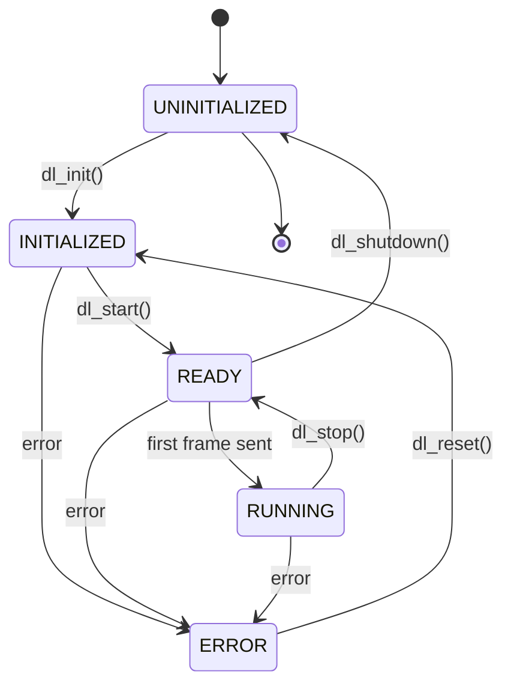
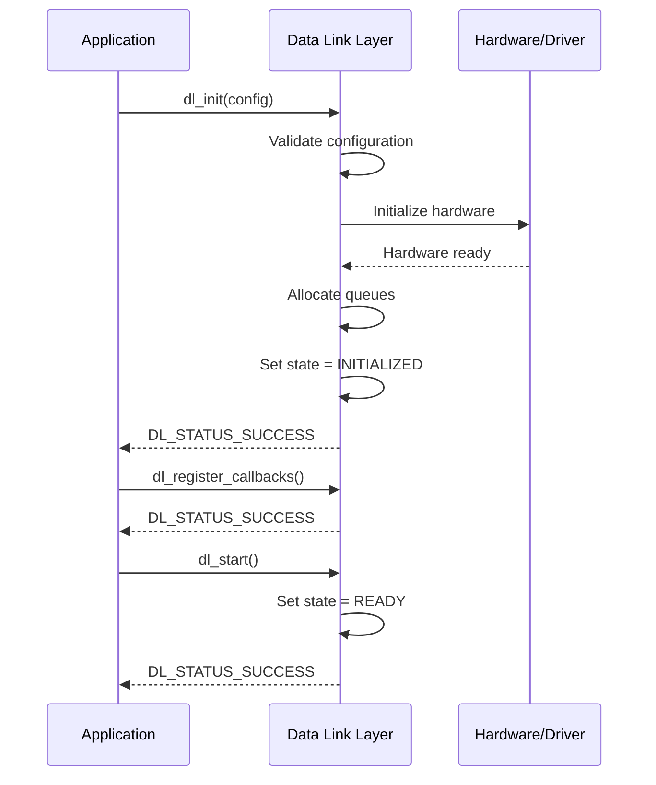
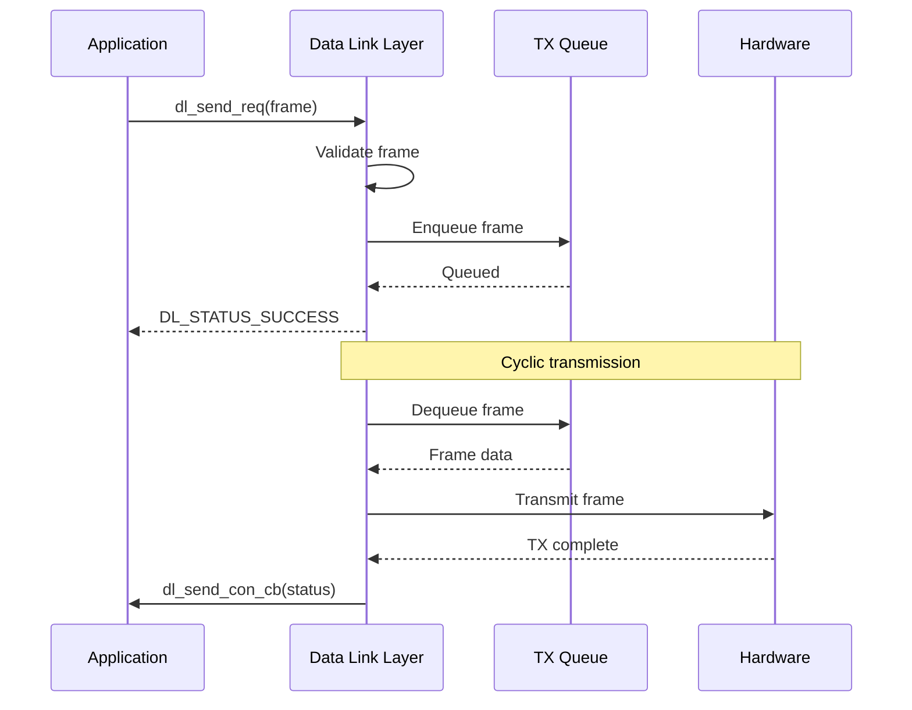
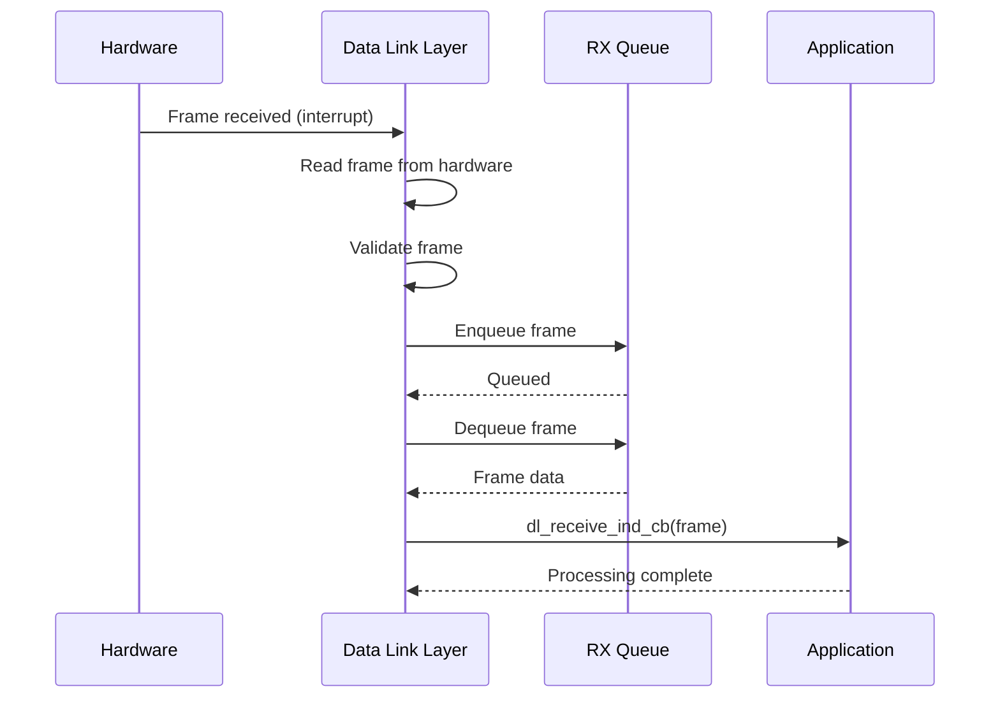

# EtherCAT Master Stack - Technical Specification

## Document Information
- **Version**: 1.0.0
- **Based on**: ETG1000 Series Version 1.0.4
- **Language**: C11
- **Target**: Embedded Systems

---

## Table of Contents
1. [Data Link Layer Services (DLL)](#data-link-layer-services-dll)
2. [Data Link Layer Protocol](#data-link-layer-protocol)
3. [Application Layer Services](#application-layer-services)
4. [Application Layer Protocol](#application-layer-protocol)

---

## Data Link Layer Services (DLL)

Based on ETG1000_3 specification, the Data Link Layer provides services for frame transmission and reception between the master and slaves.

### 1.1 DLL Service Primitives

The DLL layer provides the following service primitives:

#### 1.1.1 DL_Send Service

**Purpose**: Request transmission of an EtherCAT frame

**Service Primitives**:
- `DL_Send.req` - Request to send a frame
- `DL_Send.con` - Confirmation of frame transmission

**Parameters**:
```c
typedef struct {
    uint8_t* frame_data;      // Pointer to frame data
    uint16_t frame_length;    // Length of frame in bytes
    uint8_t priority;         // Priority level (0-7)
    void* user_data;          // User context pointer
} dl_send_req_t;

typedef struct {
    uint8_t status;           // Transmission status
    void* user_data;          // User context pointer
} dl_send_con_t;
```

**Status Codes**:
```c
typedef enum {
    DL_STATUS_SUCCESS = 0x00,
    DL_STATUS_ERROR = 0x01,
    DL_STATUS_BUSY = 0x02,
    DL_STATUS_TIMEOUT = 0x03,
    DL_STATUS_INVALID_PARAM = 0x04
} dl_status_t;
```

#### 1.1.2 DL_Receive Service

**Purpose**: Indication of received EtherCAT frame

**Service Primitives**:
- `DL_Receive.ind` - Indication of received frame

**Parameters**:
```c
typedef struct {
    uint8_t* frame_data;      // Pointer to received frame data
    uint16_t frame_length;    // Length of received frame
    uint64_t timestamp;       // Reception timestamp (nanoseconds)
    uint8_t port;             // Reception port number
} dl_receive_ind_t;
```

### 1.2 DLL Service Interface Functions

#### 1.2.1 Initialization and Configuration

```c
/**
 * Initialize the Data Link Layer
 *
 * @param config Pointer to DLL configuration structure
 * @return DL_STATUS_SUCCESS on success, error code otherwise
 */
dl_status_t dl_init(const dl_config_t* config);

/**
 * Shutdown the Data Link Layer
 *
 * @return DL_STATUS_SUCCESS on success, error code otherwise
 */
dl_status_t dl_shutdown(void);

/**
 * Configure DLL parameters
 *
 * @param param_id Parameter identifier
 * @param value Pointer to parameter value
 * @param length Length of parameter value
 * @return DL_STATUS_SUCCESS on success, error code otherwise
 */
dl_status_t dl_set_parameter(uint16_t param_id, const void* value, uint16_t length);

/**
 * Get DLL parameter value
 *
 * @param param_id Parameter identifier
 * @param value Pointer to buffer for parameter value
 * @param length Pointer to length (in: buffer size, out: actual size)
 * @return DL_STATUS_SUCCESS on success, error code otherwise
 */
dl_status_t dl_get_parameter(uint16_t param_id, void* value, uint16_t* length);
```

#### 1.2.2 Frame Transmission

```c
/**
 * Send an EtherCAT frame
 *
 * @param req Pointer to send request structure
 * @return DL_STATUS_SUCCESS on success, error code otherwise
 */
dl_status_t dl_send_req(const dl_send_req_t* req);

/**
 * Send confirmation callback (called by DLL when transmission completes)
 *
 * @param con Pointer to send confirmation structure
 */
typedef void (*dl_send_con_cb_t)(const dl_send_con_t* con);

/**
 * Register send confirmation callback
 *
 * @param callback Callback function pointer
 * @return DL_STATUS_SUCCESS on success, error code otherwise
 */
dl_status_t dl_register_send_callback(dl_send_con_cb_t callback);
```

#### 1.2.3 Frame Reception

```c
/**
 * Receive indication callback (called by DLL when frame is received)
 *
 * @param ind Pointer to receive indication structure
 */
typedef void (*dl_receive_ind_cb_t)(const dl_receive_ind_t* ind);

/**
 * Register receive indication callback
 *
 * @param callback Callback function pointer
 * @return DL_STATUS_SUCCESS on success, error code otherwise
 */
dl_status_t dl_register_receive_callback(dl_receive_ind_cb_t callback);
```

### 1.3 DLL Configuration Structure

```c
typedef struct {
    uint8_t mac_address[6];           // Master MAC address
    uint16_t max_frame_size;          // Maximum frame size (bytes)
    uint16_t tx_queue_size;           // Transmission queue size
    uint16_t rx_queue_size;           // Reception queue size
    uint32_t cycle_time_us;           // Cycle time in microseconds
    uint8_t num_ports;                // Number of Ethernet ports
    bool enable_redundancy;           // Enable redundancy support
    bool enable_distributed_clocks;   // Enable distributed clocks
} dl_config_t;
```

### 1.4 DLL State Machine

The DLL operates in the following states:

```c
typedef enum {
    DL_STATE_UNINITIALIZED = 0,
    DL_STATE_INITIALIZED,
    DL_STATE_READY,
    DL_STATE_RUNNING,
    DL_STATE_ERROR
} dl_state_t;
```

**State Transitions**:

```
UNINITIALIZED --[dl_init()]--> INITIALIZED
INITIALIZED --[dl_start()]--> READY
READY --[first frame sent]--> RUNNING
RUNNING --[dl_stop()]--> READY
READY --[dl_shutdown()]--> UNINITIALIZED
ANY_STATE --[error]--> ERROR
ERROR --[dl_reset()]--> INITIALIZED
```

#### State Machine Diagram (Mermaid)



### 1.5 DLL Control Functions

```c
/**
 * Start the Data Link Layer
 *
 * @return DL_STATUS_SUCCESS on success, error code otherwise
 */
dl_status_t dl_start(void);

/**
 * Stop the Data Link Layer
 *
 * @return DL_STATUS_SUCCESS on success, error code otherwise
 */
dl_status_t dl_stop(void);

/**
 * Reset the Data Link Layer (from ERROR state)
 *
 * @return DL_STATUS_SUCCESS on success, error code otherwise
 */
dl_status_t dl_reset(void);

/**
 * Get current DLL state
 *
 * @return Current DLL state
 */
dl_state_t dl_get_state(void);
```

### 1.6 DLL Statistics and Diagnostics

```c
typedef struct {
    uint64_t frames_sent;             // Total frames sent
    uint64_t frames_received;         // Total frames received
    uint64_t send_errors;             // Send error count
    uint64_t receive_errors;          // Receive error count
    uint64_t tx_queue_overflows;      // TX queue overflow count
    uint64_t rx_queue_overflows;      // RX queue overflow count
    uint32_t last_cycle_time_us;      // Last cycle time (microseconds)
    uint32_t max_cycle_time_us;       // Maximum cycle time observed
    uint32_t min_cycle_time_us;       // Minimum cycle time observed
} dl_statistics_t;

/**
 * Get DLL statistics
 *
 * @param stats Pointer to statistics structure
 * @return DL_STATUS_SUCCESS on success, error code otherwise
 */
dl_status_t dl_get_statistics(dl_statistics_t* stats);

/**
 * Reset DLL statistics counters
 *
 * @return DL_STATUS_SUCCESS on success, error code otherwise
 */
dl_status_t dl_reset_statistics(void);
```

### 1.7 DLL Parameter IDs

```c
typedef enum {
    DL_PARAM_MAC_ADDRESS = 0x0001,
    DL_PARAM_MAX_FRAME_SIZE = 0x0002,
    DL_PARAM_CYCLE_TIME = 0x0003,
    DL_PARAM_TX_QUEUE_SIZE = 0x0004,
    DL_PARAM_RX_QUEUE_SIZE = 0x0005,
    DL_PARAM_REDUNDANCY_ENABLE = 0x0006,
    DL_PARAM_DC_ENABLE = 0x0007,
    DL_PARAM_NUM_PORTS = 0x0008
} dl_param_id_t;
```

### 1.8 DLL Timing Requirements

Based on ETG1000_3 specification:

- **Minimum Cycle Time**: 50 microseconds (typical: 250-1000 microseconds)
- **Frame Processing Time**: < 1 microsecond per slave
- **Maximum Frame Size**: 1518 bytes (Ethernet frame)
- **Jitter Tolerance**: < 1 microsecond (with Distributed Clocks)

### 1.9 DLL Queue Management

```c
typedef struct {
    uint8_t* buffer;          // Frame buffer
    uint16_t length;          // Frame length
    uint8_t priority;         // Priority level
    void* user_data;          // User context
    uint64_t timestamp;       // Enqueue timestamp
} dl_queue_entry_t;

/**
 * Get number of frames in TX queue
 *
 * @return Number of queued frames
 */
uint16_t dl_get_tx_queue_count(void);

/**
 * Get number of frames in RX queue
 *
 * @return Number of queued frames
 */
uint16_t dl_get_rx_queue_count(void);

/**
 * Flush TX queue (discard all pending frames)
 *
 * @return DL_STATUS_SUCCESS on success, error code otherwise
 */
dl_status_t dl_flush_tx_queue(void);

/**
 * Flush RX queue (discard all pending frames)
 *
 * @return DL_STATUS_SUCCESS on success, error code otherwise
 */
dl_status_t dl_flush_rx_queue(void);
```

### 1.10 DLL Error Handling

```c
typedef enum {
    DL_ERROR_NONE = 0x00,
    DL_ERROR_INIT_FAILED = 0x01,
    DL_ERROR_INVALID_STATE = 0x02,
    DL_ERROR_QUEUE_FULL = 0x03,
    DL_ERROR_QUEUE_EMPTY = 0x04,
    DL_ERROR_INVALID_FRAME = 0x05,
    DL_ERROR_TX_TIMEOUT = 0x06,
    DL_ERROR_RX_TIMEOUT = 0x07,
    DL_ERROR_HARDWARE = 0x08,
    DL_ERROR_NO_MEMORY = 0x09,
    DL_ERROR_INVALID_PARAM = 0x0A
} dl_error_t;

/**
 * Get last DLL error code
 *
 * @return Last error code
 */
dl_error_t dl_get_last_error(void);

/**
 * Get error description string
 *
 * @param error Error code
 * @return Pointer to error description string
 */
const char* dl_get_error_string(dl_error_t error);

/**
 * Error callback function type
 *
 * @param error Error code
 * @param context Error context information
 */
typedef void (*dl_error_cb_t)(dl_error_t error, const char* context);

/**
 * Register error callback
 *
 * @param callback Callback function pointer
 * @return DL_STATUS_SUCCESS on success, error code otherwise
 */
dl_status_t dl_register_error_callback(dl_error_cb_t callback);
```

---

## Data Link Layer Protocol

Based on ETG1000_4 specification, the Data Link Layer Protocol defines the frame structure, datagram types, and addressing mechanisms for EtherCAT communication.

### 2.1 EtherCAT Frame Structure

#### 2.1.1 Ethernet Frame Format

```c
/**
 * @brief Ethernet II frame header
 */
typedef struct __attribute__((packed)) {
    uint8_t destination[6];      /**< Destination MAC address */
    uint8_t source[6];           /**< Source MAC address */
    uint16_t ethertype;          /**< EtherType (0x88A4 for EtherCAT) */
} eth_header_t;

#define ETHERCAT_ETHERTYPE 0x88A4

/**
 * @brief EtherCAT frame header
 */
typedef struct __attribute__((packed)) {
    uint16_t length : 11;        /**< Length of EtherCAT data (bits 0-10) */
    uint16_t reserved : 1;       /**< Reserved (bit 11) */
    uint16_t type : 4;           /**< Protocol type (bits 12-15) */
} ecat_header_t;

#define ECAT_TYPE_DLPDU 0x1      /**< Data Link Protocol Data Unit */
```

#### 2.1.2 Complete Frame Structure

```c
/**
 * @brief Complete EtherCAT frame
 */
typedef struct __attribute__((packed)) {
    eth_header_t eth_header;     /**< Ethernet header */
    ecat_header_t ecat_header;   /**< EtherCAT header */
    uint8_t data[1486];          /**< EtherCAT datagrams (max 1486 bytes) */
    uint32_t fcs;                /**< Frame Check Sequence (CRC32) */
} ecat_frame_t;

#define ECAT_MAX_DATA_SIZE 1486
#define ECAT_MIN_FRAME_SIZE 64
#define ECAT_MAX_FRAME_SIZE 1518
```

### 2.2 EtherCAT Datagram Structure

#### 2.2.1 Datagram Header

```c
/**
 * @brief EtherCAT datagram header
 */
typedef struct __attribute__((packed)) {
    uint8_t cmd;                 /**< Command type */
    uint8_t idx;                 /**< Index (for identification) */
    uint32_t address;            /**< Address (interpretation depends on cmd) */
    uint16_t length : 11;        /**< Data length in bytes (bits 0-10) */
    uint16_t reserved : 3;       /**< Reserved (bits 11-13) */
    uint16_t circulating : 1;    /**< Circulating frame (bit 14) */
    uint16_t more : 1;           /**< More datagrams follow (bit 15) */
    uint16_t irq;                /**< Interrupt request */
} ecat_datagram_header_t;

#define ECAT_DATAGRAM_HEADER_SIZE 10
```

#### 2.2.2 Complete Datagram Structure

```c
/**
 * @brief Complete EtherCAT datagram
 */
typedef struct __attribute__((packed)) {
    ecat_datagram_header_t header;  /**< Datagram header */
    uint8_t data[1486];             /**< Data payload */
    uint16_t wkc;                   /**< Working Counter */
} ecat_datagram_t;

#define ECAT_MAX_DATAGRAM_DATA_SIZE 1486
```

### 2.3 Datagram Command Types

#### 2.3.1 Command Type Enumeration

```c
/**
 * @brief EtherCAT command types
 */
typedef enum {
    /* Physical addressing - Auto-increment */
    ECAT_CMD_NOP = 0x00,         /**< No Operation */
    ECAT_CMD_APRD = 0x01,        /**< Auto-increment Physical Read */
    ECAT_CMD_APWR = 0x02,        /**< Auto-increment Physical Write */
    ECAT_CMD_APRW = 0x03,        /**< Auto-increment Physical Read/Write */

    /* Physical addressing - Configured */
    ECAT_CMD_FPRD = 0x04,        /**< Configured Physical Read */
    ECAT_CMD_FPWR = 0x05,        /**< Configured Physical Write */
    ECAT_CMD_FPRW = 0x06,        /**< Configured Physical Read/Write */

    /* Broadcast */
    ECAT_CMD_BRD = 0x07,         /**< Broadcast Read */
    ECAT_CMD_BWR = 0x08,         /**< Broadcast Write */
    ECAT_CMD_BRW = 0x09,         /**< Broadcast Read/Write */

    /* Logical addressing */
    ECAT_CMD_LRD = 0x0A,         /**< Logical Read */
    ECAT_CMD_LWR = 0x0B,         /**< Logical Write */
    ECAT_CMD_LRW = 0x0C,         /**< Logical Read/Write */

    /* Configured addressing with multiple slaves */
    ECAT_CMD_ARMW = 0x0D,        /**< Auto-increment Read Multiple Write */
    ECAT_CMD_FRMW = 0x0E         /**< Configured Read Multiple Write */
} ecat_cmd_t;
```

#### 2.3.2 Command Type Descriptions

```c
/**
 * @brief Get command type name
 *
 * @param cmd Command type
 * @return Pointer to command name string
 */
const char* ecat_cmd_get_name(ecat_cmd_t cmd);

/**
 * @brief Check if command is read operation
 *
 * @param cmd Command type
 * @return true if read operation, false otherwise
 */
bool ecat_cmd_is_read(ecat_cmd_t cmd);

/**
 * @brief Check if command is write operation
 *
 * @param cmd Command type
 * @return true if write operation, false otherwise
 */
bool ecat_cmd_is_write(ecat_cmd_t cmd);

/**
 * @brief Check if command is read/write operation
 *
 * @param cmd Command type
 * @return true if read/write operation, false otherwise
 */
bool ecat_cmd_is_readwrite(ecat_cmd_t cmd);
```

### 2.4 Addressing Modes

#### 2.4.1 Auto-increment Addressing

```c
/**
 * @brief Auto-increment address structure
 *
 * Used for APRD, APWR, APRW commands
 * Address format: -<slave_position> (negative position)
 */
typedef struct {
    int16_t position;            /**< Slave position (negative, -1 to -65535) */
    uint16_t offset;             /**< Memory offset within slave */
} ecat_addr_autoincrement_t;

/**
 * @brief Build auto-increment address
 *
 * @param position Slave position (1-based, will be negated)
 * @param offset Memory offset
 * @return 32-bit address value
 */
static inline uint32_t ecat_addr_autoincrement(uint16_t position, uint16_t offset)
{
    return ((uint32_t)(-position) << 16) | offset;
}
```

#### 2.4.2 Configured (Fixed) Addressing

```c
/**
 * @brief Configured address structure
 *
 * Used for FPRD, FPWR, FPRW commands
 * Address format: <configured_station_address>:<offset>
 */
typedef struct {
    uint16_t station_address;    /**< Configured station address */
    uint16_t offset;             /**< Memory offset within slave */
} ecat_addr_configured_t;

/**
 * @brief Build configured address
 *
 * @param station_address Configured station address
 * @param offset Memory offset
 * @return 32-bit address value
 */
static inline uint32_t ecat_addr_configured(uint16_t station_address, uint16_t offset)
{
    return ((uint32_t)station_address << 16) | offset;
}
```

#### 2.4.3 Logical Addressing

```c
/**
 * @brief Logical address
 *
 * Used for LRD, LWR, LRW commands
 * Address is a 32-bit logical memory address
 */
typedef uint32_t ecat_addr_logical_t;

/**
 * @brief Build logical address
 *
 * @param address Logical address (0x00000000 to 0xFFFFFFFF)
 * @return 32-bit address value
 */
static inline uint32_t ecat_addr_logical(uint32_t address)
{
    return address;
}
```

### 2.5 Working Counter

#### 2.5.1 Working Counter Definition

```c
/**
 * @brief Working counter operations
 *
 * The working counter (WKC) is incremented by each slave that
 * successfully processes a datagram.
 */

/**
 * @brief Working counter increment rules
 */
typedef enum {
    WKC_INCREMENT_READ = 1,      /**< Increment by 1 for read operations */
    WKC_INCREMENT_WRITE = 1,     /**< Increment by 1 for write operations */
    WKC_INCREMENT_READWRITE = 2  /**< Increment by 2 for read/write operations */
} wkc_increment_t;

/**
 * @brief Validate working counter
 *
 * Checks if the working counter matches the expected value
 *
 * @param expected Expected working counter value
 * @param actual Actual working counter value
 * @return true if valid, false otherwise
 */
bool ecat_wkc_validate(uint16_t expected, uint16_t actual);
```

### 2.6 Frame Building and Parsing

#### 2.6.1 Frame Builder

```c
/**
 * @brief Frame builder context
 */
typedef struct {
    uint8_t* buffer;             /**< Frame buffer */
    uint16_t buffer_size;        /**< Buffer size */
    uint16_t current_offset;     /**< Current write offset */
    uint8_t datagram_count;      /**< Number of datagrams added */
} ecat_frame_builder_t;

/**
 * @brief Initialize frame builder
 *
 * @param builder Pointer to frame builder
 * @param buffer Frame buffer
 * @param buffer_size Buffer size
 * @param src_mac Source MAC address
 * @param dst_mac Destination MAC address
 * @return DL_STATUS_SUCCESS on success, error code otherwise
 */
dl_status_t ecat_frame_builder_init(ecat_frame_builder_t* builder,
                                     uint8_t* buffer,
                                     uint16_t buffer_size,
                                     const uint8_t src_mac[6],
                                     const uint8_t dst_mac[6]);

/**
 * @brief Add datagram to frame
 *
 * @param builder Pointer to frame builder
 * @param cmd Command type
 * @param idx Datagram index
 * @param address Address (interpretation depends on cmd)
 * @param data Data to write (NULL for read operations)
 * @param length Data length
 * @param more More datagrams will follow
 * @return DL_STATUS_SUCCESS on success, error code otherwise
 */
dl_status_t ecat_frame_builder_add_datagram(ecat_frame_builder_t* builder,
                                              ecat_cmd_t cmd,
                                              uint8_t idx,
                                              uint32_t address,
                                              const uint8_t* data,
                                              uint16_t length,
                                              bool more);

/**
 * @brief Finalize frame (add FCS)
 *
 * @param builder Pointer to frame builder
 * @param frame_length Pointer to receive final frame length
 * @return DL_STATUS_SUCCESS on success, error code otherwise
 */
dl_status_t ecat_frame_builder_finalize(ecat_frame_builder_t* builder,
                                         uint16_t* frame_length);
```

#### 2.6.2 Frame Parser

```c
/**
 * @brief Frame parser context
 */
typedef struct {
    const uint8_t* buffer;       /**< Frame buffer */
    uint16_t buffer_size;        /**< Buffer size */
    uint16_t current_offset;     /**< Current read offset */
    uint8_t datagram_count;      /**< Number of datagrams parsed */
} ecat_frame_parser_t;

/**
 * @brief Initialize frame parser
 *
 * @param parser Pointer to frame parser
 * @param buffer Frame buffer
 * @param buffer_size Buffer size
 * @return DL_STATUS_SUCCESS on success, error code otherwise
 */
dl_status_t ecat_frame_parser_init(ecat_frame_parser_t* parser,
                                    const uint8_t* buffer,
                                    uint16_t buffer_size);

/**
 * @brief Validate frame headers
 *
 * @param parser Pointer to frame parser
 * @return DL_STATUS_SUCCESS if valid, error code otherwise
 */
dl_status_t ecat_frame_parser_validate(ecat_frame_parser_t* parser);

/**
 * @brief Get next datagram from frame
 *
 * @param parser Pointer to frame parser
 * @param datagram Pointer to receive datagram
 * @return DL_STATUS_SUCCESS on success, error code otherwise
 */
dl_status_t ecat_frame_parser_next_datagram(ecat_frame_parser_t* parser,
                                              ecat_datagram_t* datagram);

/**
 * @brief Check if more datagrams are available
 *
 * @param parser Pointer to frame parser
 * @return true if more datagrams available, false otherwise
 */
bool ecat_frame_parser_has_more(const ecat_frame_parser_t* parser);
```

### 2.7 CRC Calculation

```c
/**
 * @brief Calculate Ethernet FCS (CRC32)
 *
 * @param data Pointer to data
 * @param length Data length
 * @return CRC32 value
 */
uint32_t ecat_calculate_fcs(const uint8_t* data, uint16_t length);

/**
 * @brief Verify Ethernet FCS
 *
 * @param frame Pointer to frame
 * @param frame_length Frame length
 * @return true if FCS is valid, false otherwise
 */
bool ecat_verify_fcs(const uint8_t* frame, uint16_t frame_length);
```

### 2.8 Frame Timing and Constraints

```c
/**
 * @brief Frame timing constraints (from ETG1000_4)
 */
#define ECAT_FRAME_PROCESSING_TIME_NS   1000    /**< Frame processing time per slave (1 us) */
#define ECAT_MIN_FRAME_GAP_NS           960     /**< Minimum inter-frame gap (960 ns) */
#define ECAT_MAX_FRAME_RATE_HZ          100000  /**< Maximum frame rate (100 kHz) */

/**
 * @brief Calculate expected round-trip time
 *
 * @param num_slaves Number of slaves in network
 * @param cable_length_m Total cable length in meters
 * @return Expected RTT in nanoseconds
 */
uint32_t ecat_calculate_rtt(uint16_t num_slaves, uint32_t cable_length_m);
```

---

## Application Layer Services

*To be defined based on ETG1000_5*

---

## Application Layer Protocol

*To be defined based on ETG1000_6*

---

## Appendix A: Sequence Diagrams

### A.1 DLL Initialization Sequence



### A.2 Frame Transmission Sequence



### A.3 Frame Reception Sequence



---

## Appendix B: Timing Diagrams

### B.1 Cyclic Frame Transmission Timing

```
Time (us):  0        250       500       750       1000
            |---------|---------|---------|---------|
Master TX:  [Frame 1]           [Frame 2]           [Frame 3]
            |         |         |         |         |
Slave Proc: |[S1][S2][S3]      |[S1][S2][S3]      |[S1][S2][S3]
            |         |         |         |         |
Master RX:  |         [Frame 1] |         [Frame 2] |         [Frame 3]
            |<-RTT--->|         |<-RTT--->|         |<-RTT--->|

RTT = Round Trip Time (depends on number of slaves and topology)
Cycle Time = 250 us (configurable)
```

---

## Appendix C: Data Structure Memory Layout

### C.1 DLL Configuration Structure Layout

```
dl_config_t (32 bytes on 32-bit system):
+0x00: mac_address[6]           (6 bytes)
+0x06: padding                  (2 bytes)
+0x08: max_frame_size           (2 bytes)
+0x0A: tx_queue_size            (2 bytes)
+0x0C: rx_queue_size            (2 bytes)
+0x0E: padding                  (2 bytes)
+0x10: cycle_time_us            (4 bytes)
+0x14: num_ports                (1 byte)
+0x15: enable_redundancy        (1 byte)
+0x16: enable_distributed_clocks (1 byte)
+0x17: padding                  (1 byte)
```

---

## Revision History

| Version | Date | Author | Description |
|---------|------|--------|-------------|
| 1.0.0 | 2026-01-03 | Claude Code | Initial specification - DLL Services (ETG1000_3) |
| 1.1.0 | 2026-01-03 | Claude Code | Added DLL Protocol (ETG1000_4) - Frame structure, datagrams, addressing |

